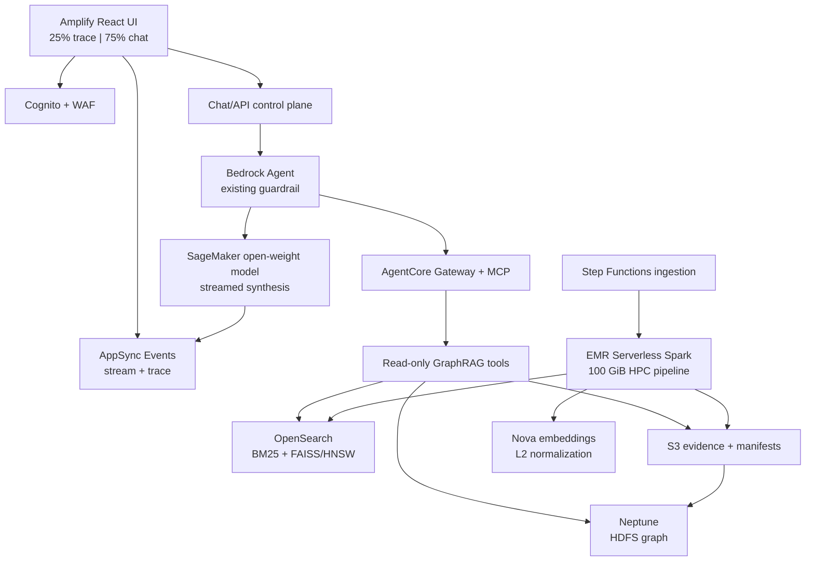
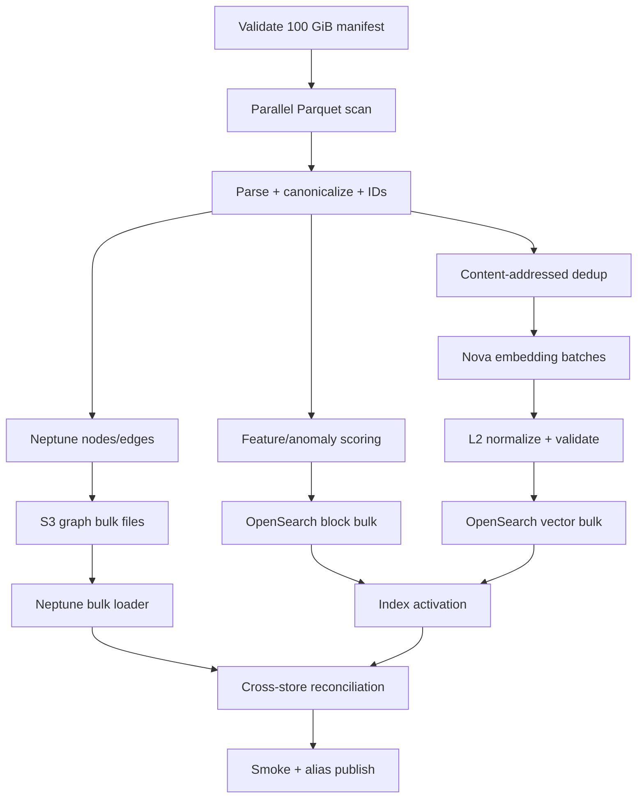

# Engineering Plan — 100 GiB HPC GraphRAG Extension on AWS

**Repository:** `hpc_autonomous_agents_demo_aws-main`  
**Plan status:** Implementation-ready design; the 600-second target remains an acceptance gate until measured in the target AWS account  
**Primary use case:** HDFS log anomaly investigation with three evidence-backed findings and human-executable remediation plans  
**Architecture rule:** Extend the working control plane; do not replace or weaken it

## 1. Executive outcome

This plan extends the existing repository with a real GraphRAG data plane while preserving its strongest implemented controls: Amazon Bedrock Agent tool selection, Amazon Bedrock AgentCore Gateway and MCP, the versioned Bedrock Guardrail, Step Functions orchestration, deterministic policy, exact evidence/plan hashing, human approval, independent verification, compensation, IAM role separation, KMS encryption, and audit state.

The added system will:

1. Pin and acquire the MIT-licensed `honicky/hdfs-logs-encoded-blocks` dataset through a managed staging job.
2. Produce a deterministic, lineage-preserving physical 100 GiB benchmark corpus in S3.
3. Convert exactly 100 GiB of staged input into a query-ready GraphRAG system in no more than 600 seconds after infrastructure and capacity are warm.
4. Index every expanded log record and its retrieval metadata in Amazon OpenSearch Service.
5. Generate Amazon Nova embeddings only for content-addressed canonical semantic units, explicitly L2-normalize them, and index them with the OpenSearch FAISS engine and HNSW method.
6. Bulk-load deterministic HDFS entities, temporal relationships, anomaly evidence, provenance, and remediation knowledge into Amazon Neptune.
7. Replace the fixture retrieval implementation behind the existing read-only MCP boundary with production OpenSearch, Neptune, S3, and fusion adapters.
8. Host a React/TypeScript operator experience in AWS Amplify. At desktop widths, 25% of the application is an auditable investigation panel and 75% is the streaming chat/results workspace.
9. Use a pinned public Apache-2.0 open-weight chat model from Hugging Face on a managed SageMaker real-time endpoint for final answer streaming. Nova remains the explicitly required embedding model, and the existing Bedrock Agent remains the governed tool orchestrator.
10. Remove every resource created by this project through a fail-closed, state-aware destroy workflow and verify that no tagged billable project resources remain.

The design does **not** expose private model chain-of-thought. The left panel presents a structured explanation trace: retrieval stage, MCP tool, reason for the call, bounded/redacted inputs, summarized output, authorization result, ranking contribution, graph path, citation, timing, and confidence.

## 2. Non-negotiable implementation rules

- No placeholders, mocks, simulated service calls, shadow integrations, fabricated measurements, silent fallback, or hardcoded AWS identifiers.
- Configuration comes from validated Terraform variables, versioned manifests, explicit deployment profiles, AWS discovery, or environment variables injected by Terraform.
- Required dependencies fail closed. An unavailable Nova model, missing quota, invalid vector, partial bulk load, count mismatch, failed guardrail, or residual resource after destroy is a failed run.
- Pin Terraform, providers, modules, containers, Python/Node dependencies, Hugging Face revisions, model license metadata, tokenizer revision, and OpenSearch/Neptune engine versions.
- Do not time Terraform provisioning, managed-service creation, model download, or external Hugging Face acquisition inside the staged-data 600-second processing SLO. Measure and report them separately.
- The target is not considered achieved until three reproducible target-account runs pass with complete manifests and no manual intervention.
- Retrieval and investigation tools remain read-only. Any operational write continues through the existing deterministic policy, exact-plan approval, executor revalidation, verification, and compensation path.
- Labels in the dataset are evaluation truth, not retrieval evidence. The agent cannot use the `label` field to “detect” anomalies.
- Every finding must resolve to immutable source records and a pipeline run manifest.

## 3. Existing code retained and extended

### 3.1 Components retained without architectural replacement

| Existing component | Decision | Extension |
| --- | --- | --- |
| `infra/modules/agentic` | Retain | Add a separate read-only GraphRAG Lambda target and new MCP schemas; keep guardrail and agent action-group controls. |
| `lambda/app/mcp_client.py` | Retain | Add pagination, typed errors, streamed progress support, deadlines, and trace propagation without changing SigV4/session behavior. |
| `lambda/app/agent_bridge_handler.py` | Retain | Expand the hard read-only allowlist and pass schema-validated query parameters rather than only `scenario_id`. |
| `lambda/app/worker_handler.py` | Retain | Accept ad hoc chat investigation requests, consume GraphRAG evidence packets, publish public trace events, and preserve the “observable tool call required” rule. |
| `lambda/app/policy.py` | Retain | No weakening. New investigation tools are read-only; write tools remain governed by the existing policy. |
| `contracts/plan.schema.json` | Retain | Add a separate answer/finding schema; do not overload the action-plan contract. |
| Step Functions remediation state machine | Retain | Continue to govern any actual action. Add a second ingestion state machine and a chat investigation path; do not merge data ingestion with remediation execution. |
| DynamoDB workflow state, S3 evidence, KMS, CloudWatch | Retain | Add ingestion manifests, chat sessions, GraphRAG evidence artifacts, metrics, and trace correlation. |
| Existing fixture/local demonstration | Retain behind an explicit `local-fixture` profile | It must never activate silently in AWS. The AWS `graphrag` profile fails if managed dependencies are unavailable. |

### 3.2 Components replaced only behind an existing interface

`lambda/app/retrieval.py` currently performs BM25-like ranking, 64-dimensional token hashing, fixture-array traversal, and simulated live-state lookup. The public `retrieve(...)` concept remains, but the AWS implementation becomes an adapter over:

- OpenSearch lexical retrieval and metadata filters;
- OpenSearch FAISS/HNSW vector retrieval;
- Neptune allowlisted multi-hop traversals;
- S3 source-evidence resolution;
- deterministic score normalization, fusion, evidence thresholds, deduplication, and abstention.

The current tool names can remain as compatibility aliases during migration, but their AWS implementation must call real stores. New versioned names are added for the anomaly investigation use case.

## 4. Definition of “100 GiB query-ready in 600 seconds”

### 4.1 Two separately reported benchmarks

**Cold acquisition benchmark** starts before downloading the pinned Hugging Face dataset and ends after the source files, checksums, dataset card, license, and acquisition manifest are committed to S3. It reports external network variability and has no fixed 600-second guarantee.

**Staged-data GraphRAG build SLO** starts only when all of the following are true:

- Terraform deployment is complete;
- OpenSearch, Neptune, EMR Serverless, SageMaker, AgentCore, and network health checks pass;
- the OpenSearch ingestion index and Neptune cluster are empty or bound to the new run namespace;
- EMR capacity is pre-initialized;
- the chat model endpoint is `InService`;
- the pinned 100 GiB input manifest is `READY` in S3;
- Nova model access and quota preflight pass;
- no previous run holds the singleflight lock.

The SLO ends only after:

- input physical bytes equal the manifest target and are at least 107,374,182,400 bytes;
- all input rows have deterministic identifiers, canonical parsing status, and S3 provenance;
- invalid rows are quarantined and counted under an approved threshold;
- every input record is represented in the OpenSearch block index;
- every distinct canonical semantic unit has one valid L2-normalized Nova vector in the vector index;
- OpenSearch mappings are active and its read alias points atomically to the completed run;
- Neptune reports successful node and edge loads with no ignored errors;
- artifact counts reconcile with OpenSearch and Neptune counts;
- lexical, vector, graph, hybrid, evidence, and top-three smoke queries pass;
- the final immutable run manifest and timing report are stored in S3 and DynamoDB;
- the GraphRAG build state is `PUBLISHED`.

The minimum raw input scan rate is:

\[
\frac{100\ \text{GiB}}{600\ \text{s}} = 170.67\ \text{MiB/s}
\]

Because parsing, embedding, indexing, and graph loading also consume time, the pipeline must provision substantially more than 170.67 MiB/s at each bottleneck and overlap independent stages.

### 4.2 Meaning of “all data is in GraphRAG”

The 100 GiB corpus is a scale expansion of a much smaller source dataset. Duplicating identical semantic content into millions of vectors and graph structures would reduce quality and make the target economically irrational. Therefore:

- all raw bytes remain in versioned S3;
- every expanded record is represented in OpenSearch with its unique record ID, base block ID, replica ID, S3 locator, canonical pattern ID, anomaly features, graph seed IDs, and run ID;
- Nova embeds each unique canonical pattern/chunk once per model version and content hash;
- Neptune represents base HDFS blocks, canonical events/templates, hosts, processes, anomaly evidence, runbooks, and compact occurrence/replication groups;
- a deterministic manifest maps every expanded occurrence to its base block and graph entities;
- the agent can retrieve any individual record through OpenSearch/S3 and traverse its semantic/operational relationships through Neptune.

This is lossless provenance with semantic deduplication, not omission.

## 5. Target AWS architecture



### 5.1 Managed service choices

| Capability | Selected service | Why | Rejected default alternative |
| --- | --- | --- | --- |
| Distributed 100 GiB transformation | EMR Serverless Spark | Extends the existing module, supports pre-initialized capacity, vectorized Parquet/Arrow work, distributed shuffle, and managed scale. | Lambda is not a data plane; Glue startup/control is less aligned with current code; EKS adds operational surface not required for this benchmark. |
| Vector/lexical retrieval | Provisioned Amazon OpenSearch Service domain, OpenSearch 3.1+ | Predictable topology, private VPC access, explicit FAISS/HNSW mapping/tuning, GPU vector-index acceleration where available, and controlled bulk settings. | Serverless is simpler but provides less deterministic capacity/control for a strict ingest SLO. |
| Operational graph | Amazon Neptune Database with a temporarily scaled benchmark writer | Optimized S3 bulk loader, low-latency online openCypher/Gremlin traversal, private VPC deployment, and explicit load control. | Neptune Analytics is strong for analytical graph scans, but this use case needs a continuously queryable operational graph behind MCP tools. Its suitability can be benchmarked as a later profile. |
| Embeddings | Amazon Nova Multimodal Embeddings through Bedrock | Explicit requirement; supports semantic retrieval and configurable dimensions. | Do not substitute token hashing or a local embedding fallback. |
| Chat synthesis | SageMaker real-time endpoint using pinned `Qwen/Qwen3-8B` | Public Apache-2.0 model, no gated approval, streaming inference, replaceable through manifest configuration. | Do not require a separately accepted marketplace agreement. Nova remains embeddings; the existing Bedrock Agent remains orchestration. |
| Agent/tool governance | Existing Bedrock Agent + AgentCore Gateway/MCP | Already implements the required read-tool boundary and observable tool selection. | No rewrite to a custom ungoverned loop. |
| Realtime UI events | AWS AppSync Events | Managed WebSocket pub/sub, Cognito/IAM authorization, low-latency trace/token delivery, and an Amplify JavaScript client. | Polling would weaken responsiveness; exposing task tokens or direct database access to the browser is prohibited. |
| Web application | Amplify Hosting | Managed HTTPS/CDN hosting and straightforward static React deployment. | The existing inline Lambda HTML remains only as a legacy/local view. |
| Identity | Amazon Cognito | User authentication, groups, token claims, and separation between investigator/approver/admin roles. | The existing shared demo token is not sufficient for the new hosted chat UI. It can remain for legacy smoke tests only. |

## 6. Terraform extension plan

Terraform provisions infrastructure. It must not use `local-exec` to download data, train models, or mutate indexes. Managed jobs and explicit scripts invoke runtime actions after `terraform apply`.

### 6.1 New modules

```text
infra/modules/
  network/
  graphrag_data/
  opensearch/
  neptune/
  model_serving/
  ingestion/
  realtime/
  amplify_ui/
  observability/
```

**`network`**

- One VPC across three availability zones.
- Private processing/data subnets and public ingress only where a managed edge requires it.
- Separate security groups for EMR, GraphRAG tools, OpenSearch, Neptune, SageMaker, and control-plane Lambdas.
- S3 and DynamoDB gateway endpoints.
- Interface endpoints for KMS, ECR API/DKR, CloudWatch Logs, STS, Secrets Manager, SageMaker Runtime, Bedrock Runtime, and other region-supported services used by the selected profile.
- No broad `0.0.0.0/0` ingress. Security-group references define east/west access.
- The existing bridge Lambda remains outside the data VPC when it only calls public managed APIs. The new GraphRAG tool Lambda runs in private subnets.

**`graphrag_data`**

- Separate versioned S3 buckets or strictly separated prefixes for raw, curated, bulk-load, evidence/audit, model artifacts, and UI deployments.
- KMS encryption with bucket keys and TLS-only policies.
- DynamoDB tables for ingestion runs, chat sessions, idempotency, and the singleflight run lease.
- Glue Data Catalog tables for source/curated Parquet where useful for validation and ad hoc inspection.
- Demo profile uses `force_destroy=true`; production profile defaults false.
- No Object Lock in the ephemeral demo profile because retained objects would prevent guaranteed teardown.

**`opensearch`**

- VPC-only provisioned domain on an explicitly pinned OpenSearch version that supports the selected FAISS/HNSW and vector-acceleration features.
- At least three dedicated cluster-manager nodes for a non-demo production profile; benchmark profile can explicitly trade HA for ingest speed and cost.
- KMS at-rest encryption, node-to-node encryption, HTTPS-only, fine-grained access control, audit/error/slow logs, and IAM domain policy.
- Storage, data-node count/type, shard count, replicas, HNSW parameters, GPU vector acceleration, and ingestion settings come from a validated `performance_profile` object.
- A read alias and run-specific write indexes enable atomic publication and rollback.

**`neptune`**

- Neptune DB cluster, subnet group, cluster parameter group, instance parameter group, benchmark writer instance, optional readers, IAM database authentication, TLS, KMS, audit logs, and S3 bulk-loader IAM role.
- Benchmark profile scales the writer to the approved high-throughput class before the timed run and removes readers during the bulk load.
- Demo profile skips a final snapshot on destroy only when an explicit validated variable permits it.

**`model_serving`**

- Managed CodeBuild staging job retrieves a pinned public Hugging Face revision and stores model/tokenizer artifacts in S3 with a license/checksum manifest.
- ECR/LMI or approved Hugging Face inference container is pinned by digest.
- SageMaker model, endpoint configuration, real-time endpoint, data-capture policy, autoscaling target, CloudWatch alarms, and least-privilege role.
- Default model manifest identifies `Qwen/Qwen3-8B`, Apache-2.0, the exact immutable commit SHA, tokenizer revision, precision/quantization, content checksums, context length, and serving image digest.
- Deployment fails if license metadata is missing, the repo is gated, checksums differ, or the model does not pass tool/JSON/streaming conformance tests.

**`ingestion`**

- CodeBuild project for pinned Hugging Face acquisition.
- Revised EMR Serverless application with VPC connectivity, pre-initialized capacity, managed serverless storage where supported, and Prometheus/CloudWatch metrics.
- A GraphRAG ingestion Step Functions state machine separate from the remediation state machine.
- EventBridge rules for job completion/failure and alarms for timeout, reject threshold, count mismatch, Bedrock throttling, OpenSearch rejection, and Neptune loader failure.

**`realtime`**

- AppSync Event API with `/sessions/{subject}/{session_id}` channels.
- Cognito authorization for user subscriptions; IAM-only publishing from the chat worker.
- Chat request Lambda/API endpoint, session table, stream publisher permissions, payload-size controls, and per-user throttling.
- Event schemas for `status`, `tool_start`, `tool_result`, `ranking`, `graph_path`, `citation`, `token`, `finding`, `guardrail`, `error`, and `complete`.

**`amplify_ui`**

- Amplify application, branch, environment configuration, deployment role, custom headers, SPA rewrites, Cognito user pool/client/groups, WAF association where supported by the chosen edge topology, and output URLs.
- Static assets are built reproducibly and deployed through an explicit S3/manual Amplify deployment job; Terraform creates the managed hosting resources.

**`observability`**

- CloudWatch dashboards and alarms for the critical path, OpenSearch, Neptune, EMR, SageMaker, AgentCore, AppSync, and Lambda.
- X-Ray or OpenTelemetry propagation using `trace_id`, `session_id`, `workflow_id`, and `pipeline_run_id`.
- CloudTrail data events only for the necessary high-value resources; avoid logging sensitive payloads.
- AWS Budget alerts and cost-allocation tags.

### 6.2 Existing module changes

- `infra/main.tf`: compose new modules and pass only explicit outputs; no cyclic dependencies.
- `infra/variables.tf`: add typed nested objects for dataset, benchmark, embedding, OpenSearch, Neptune, model serving, UI, networking, and destroy behavior. Validate region support and mutually dependent settings.
- `infra/environments/demo.tfvars`: contain a complete disposable profile; no secret values.
- `infra/modules/analytics`: replace synthetic analyzer wiring with the versioned GraphRAG job package, add pre-initialized capacity and VPC networking, and upload job manifests/scripts by content hash.
- `infra/modules/agentic`: add a separate read-only GraphRAG Lambda target and schema-described tools. Keep lifecycle/write tools in the existing target and keep their role inaccessible to the Bedrock Agent bridge.
- `infra/modules/api`: retain legacy endpoints and add Cognito-protected chat/session endpoints; do not return AgentCore session credentials, approval task tokens, or service endpoints to the browser.
- `infra/outputs.tf`: publish only safe operational outputs. Mark tokens/secrets sensitive.

### 6.3 Required configuration objects

Every setting below is supplied by a versioned deployment profile and copied into the run manifest:

- AWS account ID, region, environment, project prefix, and expiry/owner tags;
- dataset repo, immutable revision, split files, expected checksums, license, target bytes, expansion seed, and record schema version;
- EMR release, architecture, driver/executor shape, min/initial/max executors, partition target, shuffle partitions, and serverless-storage setting;
- Nova model ID/version, dimension, embedding purpose, batch/concurrency limits, quota headroom, and normalization tolerance;
- OpenSearch version/topology, shards, replicas, storage, bulk payload size, concurrent clients, refresh/translog settings, FAISS/HNSW parameters, and vector-acceleration setting;
- Neptune engine version, writer class/capacity, query language, loader parallelism, file size target, and graph schema version;
- chat model repo/revision/license/checksums, precision, instance type/count, autoscaling, token limits, and streaming timeout;
- guardrail ID/version, tool registry version, policy version, action/runbook catalog version, and UI build version.

## 7. Dataset acquisition and deterministic 100 GiB corpus

The referenced dataset has 575,061 rows across stratified train/validation/test splits and fields `block_id`, `event_encoded`, `tokenized_block`, and `label`. Its repository is approximately 174 MB, so a controlled expansion is required for a 100 GiB physical benchmark.

### 7.1 Acquisition

1. Terraform creates a CodeBuild project and least-privilege S3 role.
2. `make stage-hf` starts the job with the immutable dataset revision from the deployment profile.
3. The job downloads only the public dataset files, README/card, and license metadata; no Hugging Face token is accepted by the default profile.
4. It computes SHA-256 for every file, verifies the expected revision/license, writes an acquisition manifest, and uploads to `s3://.../raw/source/<revision>/`.
5. The state transitions to `SOURCE_STAGED` only if every checksum and required split passes.

### 7.2 Expansion

The existing generator's unrelated random-looking filler is insufficient for a meaningful GraphRAG claim. Replace it with a deterministic benchmark record envelope:

```text
record_id       = sha256(dataset_revision || split || base_block_id || replica_id || row_ordinal)
pattern_id      = sha256(canonical_event_sequence)
source_hash     = sha256(original logical fields)
payload_hash    = sha256(expansion_seed || record_id || segment_ordinal)
```

The expansion may add deterministic incompressible benchmark payload bytes to reach exactly 100 GiB physical storage, but those bytes are explicitly typed as `benchmark_payload`, excluded from embeddings/graph semantics, and covered by their own hashes. Meaningful fields are varied only through declared deterministic transforms such as timestamp offsets or collision-free host namespace remapping. Labels are never changed.

Write 256–512 MiB Parquet shards with row-group statistics, explicit schema, stable partitioning by split and hash bucket, and a manifest containing physical bytes, logical bytes, row counts, hashes, min/max IDs, source lineage, and expansion parameters. The job must trim the final partition deterministically so the accepted corpus is exactly the configured byte target within the file-format constraints.

### 7.3 Label isolation

- Training labels may be used only by the versioned anomaly model build.
- Validation/test labels are written to an evaluation-only prefix encrypted and authorized separately.
- OpenSearch user-facing indexes and Neptune do not include the truth label.
- Evaluation joins predictions to truth after retrieval using record IDs under an evaluation role unavailable to the agent.

## 8. HPC GraphRAG build

### 8.1 Processing DAG



### 8.2 Spark implementation

- Use Spark SQL/DataFrame expressions, Arrow-compatible columnar operations, and map-partition clients only where a service call is unavoidable.
- Do not use Python UDFs for parsing, hashing, numeric feature construction, or L2 normalization when a JVM/vectorized expression exists.
- Partition by stable hash rather than block ID alone to avoid hot blocks and skew.
- Use one persistent Bedrock/OpenSearch client per partition, bounded connection pools, bounded retry queues, jitter, and explicit deadlines.
- Prevent CPU oversubscription: executor cores, Python worker reuse, `OMP_NUM_THREADS`, `MKL_NUM_THREADS`, BLAS threads, and any FAISS threads are derived from the profile and must not exceed allocated cores.
- Checkpoint after canonicalization and after embedding normalization so a failed sink can resume without rescanning/re-embedding.
- Use deterministic task output paths and conditional manifest commits for idempotency.
- Measure bytes/second, rows/second, partitions, skew, spill, shuffle, GC, service throttles, rejected documents, and stragglers per stage.

### 8.3 Parallel sinks and backpressure

- OpenSearch block documents begin bulk indexing as canonical partitions complete.
- Unique pattern embedding begins as dedup partitions complete.
- Neptune node/edge files are produced concurrently and loaded as soon as complete dependency groups are available.
- A bounded token-bucket controller limits Nova requests to the measured service quota.
- OpenSearch bulk clients reduce concurrency on sustained 429/write rejection and increase only after a healthy window.
- Neptune loader jobs are queued with explicit dependencies. Node and edge prefixes remain separate.
- No retry can change a record ID or duplicate a side effect. Sink operations use deterministic document/vertex/edge IDs.

### 8.4 Capacity model and timing budget

The existing maximum of 400 vCPU provides a reasonable first benchmark ceiling but is not proof of the SLO. Start with 48 executors × 8 cores, then tune from measured stage throughput. Capacity is pre-initialized immediately before the run and auto-stopped after it.

| Critical-path stage | Initial budget | Required evidence |
| --- | ---: | --- |
| Manifest validation and run lease | 15 s | Input bytes/count/hash and service/quota health |
| Parallel scan, parse, canonicalization, features | 210 s | ≥ target scan rate, skew/spill/CPU metrics |
| Nova embedding of distinct patterns + normalization | 180 s, overlapped | Unique count, requests/s, throttle rate, norm checks |
| OpenSearch block/vector ingestion and activation | 240 s, overlapped | docs/s, MB/s, graph build time, rejection count |
| Neptune bulk load | 180 s, overlapped after artifacts | nodes/s, edges/s, loader status/errors |
| Reconciliation, smoke queries, alias publication | 45 s | exact counts and query results |
| Total wall clock | ≤600 s | State-machine monotonic timestamps |

The phase overlaps are intentional; stage budgets do not sum linearly. A preflight estimator calculates required executor count, Nova request rate, OpenSearch document rate, and Neptune node/edge rate from the actual manifest. If approved quotas/capacity cannot satisfy the estimate with configured headroom, the run fails before starting.

Spot capacity can be used for non-critical preprocessing only when an On-Demand fallback profile is already available and checkpoint recovery is proven. The formal SLO profile uses pre-warmed On-Demand capacity unless repeated tests show Spot interruption does not violate correctness or timing.

## 9. Embeddings, FAISS, and OpenSearch HNSW

### 9.1 Canonical semantic units

Do not embed the deterministic benchmark payload or duplicate replicas. Embed:

- canonical event sequences;
- event-template descriptions;
- bounded anomaly-evidence summaries generated from structured features, not from labels;
- approved runbook/action descriptions.

Each embedding record includes model/version, dimension, purpose, input/content hash, source/base block IDs, event time/window, dataset revision, run ID, provenance URI, tenancy/classification, graph IDs, and pre/post-normalization norms.

### 9.2 Explicit L2 normalization

For vector \(\mathbf{x}\):

\[
\hat{\mathbf{x}} = \frac{\mathbf{x}}{\lVert\mathbf{x}\rVert_2}
\]

Reject rather than repair:

- zero or near-zero norm;
- NaN or infinite components;
- dimension mismatch;
- truncated response;
- model/version mismatch;
- duplicate ID with different content hash;
- norm outside the configured tolerance after normalization.

Because vectors are explicitly normalized, use OpenSearch `innerproduct` for equivalent cosine ranking with explicit normalization control. Do not request `cosinesimil` and then claim the stored input is unchanged, because the FAISS engine may normalize automatically.

### 9.3 Required OpenSearch mapping template

Terraform or an idempotent index-bootstrap job renders this template from validated variables. Example values are profile inputs, not constants embedded in application code:

```json
{
  "settings": {
    "index.knn": true,
    "index.knn.algo_param.ef_search": "${ef_search}",
    "number_of_shards": "${vector_shards}",
    "number_of_replicas": "${bulk_replica_count}",
    "refresh_interval": "${bulk_refresh_interval}"
  },
  "mappings": {
    "dynamic": "strict",
    "properties": {
      "record_id": {"type": "keyword"},
      "pattern_id": {"type": "keyword"},
      "content": {"type": "text"},
      "content_hash": {"type": "keyword"},
      "dataset_revision": {"type": "keyword"},
      "pipeline_run_id": {"type": "keyword"},
      "event_time": {"type": "date"},
      "block_id": {"type": "keyword"},
      "host_ids": {"type": "keyword"},
      "graph_entity_ids": {"type": "keyword"},
      "provenance_uri": {"type": "keyword", "index": false},
      "tenant_id": {"type": "keyword"},
      "classification": {"type": "keyword"},
      "embedding_model": {"type": "keyword"},
      "embedding_dimension": {"type": "integer"},
      "normalization": {"type": "keyword"},
      "embedding": {
        "type": "knn_vector",
        "dimension": "${embedding_dimension}",
        "method": {
          "name": "hnsw",
          "engine": "faiss",
          "space_type": "innerproduct",
          "parameters": {
            "m": "${hnsw_m}",
            "ef_construction": "${hnsw_ef_construction}"
          }
        }
      }
    }
  }
}
```

Use separate run-specific indexes for block/event documents, vectors/patterns, and anomaly findings. This avoids placing a large vector in every duplicate occurrence and permits different shard/retention policies.

During bulk load, the benchmark profile may set replicas to zero, disable periodic refresh, and use approved transient durability settings. Before `PUBLISHED`, it must flush, refresh/build the HNSW graph, restore the profile's serving refresh/replica settings, wait for required health, run recall/latency tests, and then swap the read alias. The formal query-ready definition must state whether replica restoration is inside the 600-second target; for this plan it is inside unless a separately named non-HA benchmark profile is used.

### 9.4 FAISS relationship to OpenSearch

FAISS has two legitimate roles:

1. OpenSearch uses the FAISS engine to build and query its production HNSW index.
2. The pipeline may use partition-local/exact FAISS indexes offline to calculate ground-truth nearest neighbors and Recall@k for a sample.

Do not build a standalone FAISS file and describe it as the production OpenSearch index. The production serving index is owned and activated by OpenSearch.

## 10. Neptune HDFS graph

Use a property graph and openCypher for this implementation because the use case is operational path traversal rather than ontology reasoning. If RDF/SPARQL is later required, preserve the same deterministic identity/provenance model and add a separately validated RDF publication profile.

### 10.1 Node labels

| Label | Identity basis | Core properties |
| --- | --- | --- |
| `SourceRecord` | expanded `record_id` or compact occurrence-group ID | S3 locator, source hash, split, row group, run ID, classification |
| `HDFSBlock` | dataset revision + base block ID | block ID, first/last event time, event count, pattern ID |
| `LogEvent` | source record + event ordinal | event type, timestamp/offset, severity, canonical hash |
| `LogTemplate` | canonical template hash | event code, normalized template, frequency, embedding pattern ID |
| `DataNode` | canonical host/IP namespace ID | host/IP, role, first/last seen |
| `NameNode` | canonical host/IP namespace ID | host/IP, role, first/last seen |
| `Host` | normalized host identity | address, namespace, environment |
| `Process` | host + process/port role | process type, port, observed window |
| `Session` | stable connection/session key | source/destination, start/end, event count |
| `TimeWindow` | run + configured bucket start | start, end, duration |
| `Error` | canonical error signature | signature, template, count, severity |
| `Warning` | canonical warning signature | signature, template, count, severity |
| `Anomaly` | scorer version + finding key | score, calibrated confidence, severity, detection time |
| `AnomalyType` | governed catalog ID | name, description, evidence requirements |
| `Evidence` | evidence content hash | feature values, source IDs, rank contribution |
| `RecommendedAction` | runbook catalog version + action ID | human steps, validation, rollback/escalation, required role |
| `PipelineRun` | immutable run ID | dataset/model/schema versions, timing, status, manifest hash |
| `ReplicationGroup` | run + base block + replica range | occurrence count and deterministic range mapping |

### 10.2 Relationships

- `EMITTED_BY`: `LogEvent → Process/DataNode/NameNode`
- `OCCURRED_ON`: `LogEvent/Anomaly → Host/TimeWindow`
- `REFERENCES_BLOCK`: `LogEvent/Anomaly/SourceRecord → HDFSBlock`
- `PRECEDES`: bounded adjacent event transitions; do not materialize an all-pairs temporal graph
- `CORRELATED_WITH`: evidence-backed relation with method, score, and window
- `MATCHES_TEMPLATE`: `LogEvent/HDFSBlock → LogTemplate`
- `INDICATES`: `Evidence/Error/Warning → Anomaly/AnomalyType`
- `SUPPORTS`: `Evidence → Anomaly`
- `CAUSED_BY`: only when a governed rule/evidence threshold supports the relation; otherwise use `POSSIBLY_RELATED_TO`
- `AFFECTS`: `Anomaly → HDFSBlock/DataNode/Host/Process`
- `HAS_EVIDENCE`: `Anomaly → Evidence`
- `RECOMMENDS`: `AnomalyType → RecommendedAction`
- `DERIVED_FROM`: graph artifact/evidence → source record/manifest
- `INGESTED_BY`: entity/artifact → pipeline run
- `EXPANDS_TO`: base block/replication group → deterministic occurrence range

Every node and edge includes `id`, `pipeline_run_id`, `dataset_revision`, `source_hash` or `provenance_uri`, `valid_from`, `valid_to` where applicable, `classification`, and `tenant_id`.

### 10.3 Bulk-load artifacts

Spark writes Neptune openCypher CSV files under separate prefixes:

```text
graphrag/runs/<run_id>/neptune/
  nodes/<label>/part-*.csv
  edges/<relationship>/part-*.csv
  manifests/nodes.json
  manifests/edges.json
  rejected/*.jsonl
```

Target 256–512 MiB files rather than thousands of tiny objects. Load nodes before edges. Use `failOnError=TRUE`, `mode=NEW`, controlled `OVERSUBSCRIBE` parallelism for the benchmark writer, and explicit loader dependencies. Any deadlock/error is a failed run; an idempotent resume uses the same deterministic IDs and loader job manifest.

### 10.4 Validation queries

- Count nodes and edges by label/type and compare to artifact manifests.
- Verify every `Anomaly` has at least one `HAS_EVIDENCE`, one `AFFECTS`, one `INGESTED_BY`, and one source-provenance path.
- Verify every recommended action is reached through a governed `AnomalyType`.
- Detect dangling edges, missing endpoints, duplicate deterministic IDs, invalid tenant/run IDs, and provenance gaps.
- Validate representative temporal sequences, repeated block failures, host-specific concentration, abnormal transitions, correlated failures, and the path `Anomaly → Evidence → SourceRecord`.
- Run bounded multi-hop query templates used by MCP and compare their outputs to test fixtures generated from the real ingested corpus.

## 11. Anomaly detection and hybrid GraphRAG ranking

### 11.1 Detection without label leakage

Build a versioned anomaly scorer from the source training split using structured event-transition, frequency, sequence-length, host/block, session, and temporal features. A Spark ML baseline such as hashing/TF-IDF plus logistic regression or gradient-boosted trees is acceptable because it is auditable and fast, but model selection must be based on validation metrics. The model artifact, feature schema, threshold, calibration, training revision, and checksum are pinned.

During the timed run, score all records using the frozen model. The agent and retrieval stores receive predicted score, calibrated confidence, feature contributions, and novelty statistics—not the truth label. Evaluation later joins test record IDs to the isolated labels.

### 11.2 Retrieval branches

1. **Lexical:** BM25 over canonical event text, error signatures, templates, runbooks, and selected metadata.
2. **Vector:** Nova query embedding, explicit L2 normalization, OpenSearch FAISS/HNSW top-k with tenant/run/time filters.
3. **Structured:** anomaly score, severity, host/block/time-window, event-transition rarity, frequency, and required classification filters.
4. **Graph:** Neptune traversal from candidate block/pattern/host IDs to evidence, correlated failures, affected assets, anomaly type, and governed action.
5. **Source:** exact evidence excerpts and immutable S3 locators for candidates that survive fusion.

### 11.3 Fusion policy

No raw score from one retriever is directly added to another. Normalize per branch using a versioned policy:

- lexical/vector ranks use reciprocal-rank fusion;
- calibrated anomaly probability and temporal/graph evidence use bounded [0,1] scores;
- graph path evidence is weighted by allowed relationship type, hop count, provenance completeness, freshness, and confidence;
- duplicates are grouped by `pattern_id`, affected asset, and time window so the top three are distinct operational findings;
- a required evidence threshold prevents a high vector similarity alone from becoming an anomaly finding.

Example policy expression, rendered from configuration:

\[
S(f)=w_r RRF(f)+w_a A(f)+w_g G(f)+w_t T(f)+w_p P(f)
\]

where:

- \(RRF(f)\): fused lexical/vector rank;
- \(A(f)\): calibrated anomaly score;
- \(G(f)\): validated graph-path evidence;
- \(T(f)\): temporal/frequency abnormality;
- \(P(f)\): provenance and source-quality score;
- \(w_*\): versioned, non-negative weights that sum to one.

Abstain when fewer than three findings meet the evidence threshold. The response may return one or two findings plus an explicit insufficiency statement; it must never pad the answer.

### 11.4 Top-three finding contract

Each result contains:

- rank, finding ID, anomaly type, severity, and calibrated confidence;
- concise explanation and uncertainty;
- affected blocks, nodes, hosts, processes, sessions, and time windows;
- source events and immutable citations;
- normalized retrieval/ranking factors;
- one or more bounded graph paths;
- probable cause, explicitly marked as hypothesis unless the evidence rule proves it;
- a governed, step-by-step human action plan;
- preconditions, safety notes, expected result, validation commands/queries, rollback/escalation, and required human role;
- model, embedding, graph schema, tool registry, policy, runbook, and pipeline versions.

## 12. MCP tool design

Add the following read-oriented tools as a separate AgentCore Gateway Lambda target. Schemas live in `contracts/graphrag-tools/*.schema.json`, are loaded by tests, and are also rendered into the Terraform AgentCore tool schema. There must be one source of truth with generation/checksum validation.

| Tool | Purpose | Required bounds |
| --- | --- | --- |
| `search_log_events` | OpenSearch lexical/vector/hybrid search and metadata filtering | `top_k≤50`; bounded time range; allowed fields/operators; page token; tenant/run filters injected from identity, not caller text |
| `query_hdfs_graph` | Parameterized Neptune traversal | named template only; `max_hops≤3`; `limit≤200`; allowlisted relationship types; no caller-supplied openCypher |
| `get_anomaly_evidence` | Resolve source events, features, graph paths, provenance, and rank contributions | ≤20 finding IDs; excerpt/output byte cap; signed locators never exposed as long-lived URLs |
| `correlate_block_failures` | Find repeated and temporally related failures for a block | ≤20 block IDs; bounded window; deterministic cohort and correlation method |
| `analyze_node_behavior` | Compare a node with an appropriate baseline | ≤10 nodes; bounded period; declared cohort; minimum sample size or abstain |
| `rank_anomalies` | Apply the approved fusion policy and return up to three findings | server controls candidate cap/weights; no arbitrary scoring expression |
| `generate_remediation_plan` | Retrieve and format governed human runbook steps | read-only catalog; approved anomaly types/actions; output schema; never calls a write API |
| `validate_remediation` | Run read-only follow-up retrieval to assess whether indicators improved | requires original finding/evidence hash; bounded observation window; returns verified/not-verified/insufficient |

Each tool must implement:

- strict JSON Schema with `additionalProperties=false`;
- Cognito/AgentCore/IAM identity propagation and tenant authorization;
- hard input cardinality, time, hop, result, and output-byte limits;
- deadlines shorter than the invoking Lambda deadline;
- parameterized query templates and field/operator allowlists;
- cursor pagination with integrity-protected tokens;
- `trace_id`, `session_id`, `workflow_id`, `pipeline_run_id`, tool version, and evidence hash;
- typed error codes: `VALIDATION_FAILED`, `UNAUTHORIZED`, `NOT_READY`, `INSUFFICIENT_EVIDENCE`, `THROTTLED`, `DEPENDENCY_FAILED`, `DEADLINE_EXCEEDED`, `INTEGRITY_FAILED`;
- structured audit events without secrets, raw credentials, private chain-of-thought, or unbounded log payloads;
- retrieved-content escaping and clear separation between evidence and instructions.

### 12.1 Tool selection behavior

The existing Bedrock Agent instruction remains: call the smallest useful read-only tool set before answering. For the primary prompt “Identify the three most important anomalous HDFS behaviors and tell me what to do,” the expected path is:

1. `rank_anomalies` to select distinct candidates from OpenSearch/feature scores;
2. `query_hdfs_graph` to connect candidates to evidence, assets, correlated failures, and runbooks;
3. `get_anomaly_evidence` to resolve citations and feature/rank details;
4. `generate_remediation_plan` to return bounded human steps.

The agent may call `correlate_block_failures` or `analyze_node_behavior` when the first evidence packet shows those tools would discriminate between causes. It must not call every tool mechanically.

## 13. Guardrails and authority preservation

The GraphRAG extension does not alter the existing safety model.

- The versioned Bedrock Guardrail remains attached to the Bedrock Agent.
- Call `ApplyGuardrail` on chat input before retrieval and on streamed open-weight model output before publication. Buffer output into bounded semantic chunks so unsafe content is not displayed before evaluation.
- The model does not receive credentials or direct OpenSearch/Neptune endpoints.
- AgentCore Gateway remains the MCP entry point.
- The Bedrock Agent bridge can invoke only read tools; the GraphRAG tool Lambda role has OpenSearch read, Neptune query, and bounded S3 read permissions only.
- The existing workflow role remains the only role able to invoke lifecycle/write tools.
- A generated remediation plan is advice for a human. It is not execution authority.
- If a future UI button requests an action, it creates the existing hash-bound Step Functions workflow and approval request; it never directly calls an action tool.
- Every tool result is treated as untrusted evidence and schema-validated before reaching the model.
- The public UI displays authorization and policy outcomes but never an approval task token.

### 13.1 Mandatory in-chat approval for autonomous MCP selection

The implemented GraphRAG path adds a control stricter than the original read-only requirement. It uses a dedicated Bedrock Agent whose `GraphRAGReadTools` action group is configured with `RETURN_CONTROL`. The Agent may autonomously select read functions and concrete arguments, but Bedrock returns that selection to the application without executing it. The application validates the closed tool schema, rejects query rewriting and non-read authority, canonicalizes the plan, binds it to the chat/session/round/expiration, and presents its SHA-256 hash in the chat UI.

The human must approve the exact current hash before the worker can invoke AgentCore MCP. The worker revalidates the plan and approval immediately before the call. Rejection, expiration, mutation, replay, cross-chat reuse, or dispatch failure stops execution. Each additional Agent selection round creates a new plan and requires another in-chat approval. This analysis approval remains independent of the existing deterministic policy and exact-plan write approval used by the remediation workflow.

## 14. Streaming chat and open-weight model

### 14.1 Default model profile

Use `Qwen/Qwen3-8B` as the initial main-chat synthesis model because its Hugging Face model card identifies Apache-2.0 and it is public/non-gated. This is a proposed default, not a permanently hardcoded dependency. The manifest must pin the exact revision after conformance/performance testing.

The model stage must preserve:

- repository and immutable commit SHA;
- Apache-2.0 license text and attribution/notice obligations;
- tokenizer files/revision;
- precision or quantization and its derivation;
- SHA-256 for every artifact;
- serving container digest and vLLM/TGI/LMI version;
- prompt/tool schema version and conformance results.

The endpoint uses `InvokeEndpointWithResponseStream`. The model receives only the bounded evidence packet, public explanation trace, answer schema, and approved runbook content. Bedrock Agent tool selection completes before final synthesis, but status/tool/evidence events stream immediately so the UI is responsive.

### 14.2 Streaming flow

1. Cognito-authenticated UI subscribes to its AppSync session channel.
2. `POST /chat` validates identity, request schema, rate limits, and input guardrail; it returns `202` and a session/request ID.
3. Chat worker publishes `status=investigating`.
4. Bedrock Agent invokes MCP; each observable tool call publishes a sanitized `tool_start` and `tool_result` event.
5. Ranking and graph-path events populate the left panel and finding shells.
6. The worker calls the SageMaker streaming endpoint with the final evidence packet.
7. Output is guardrailed in bounded chunks, then published as token/delta events.
8. A final schema-validated answer object and evidence hash are stored in S3/DynamoDB and published as `complete`.

Target user-facing SLOs after warm-up:

- request accepted: p95 ≤500 ms;
- first investigation status: p95 ≤1 s;
- first ranked evidence card: p95 ≤2.5 s for common queries;
- first safe answer token: p95 ≤3 s;
- complete top-three answer: p95 ≤12 s, subject to bounded tool/model limits.

## 15. Amplify UI/UX specification based on the four supplied references

The supplied designs are inspiration for visual language only. Do not copy their logos, names, mascots, proprietary assets, or exact composition.

### 15.1 Visual direction

Common cues to adopt:

- near-black application canvas with charcoal/graphite panels;
- subtle blue/teal radial light behind the primary workspace;
- restrained cyan-to-blue accents for selected controls and live states;
- large rounded shells, medium rounded cards, thin low-contrast borders, and sparse shadow/glow;
- simple monochrome line icons with one active accent state;
- large confident headings, quieter gray supporting text, and high-contrast operational numbers;
- a visually dominant prompt composer with compact controls inside its footer;
- cards that reveal the next practical action rather than decorative dashboard clutter;
- generous whitespace even in a dense technical application.

### 15.2 Desktop information architecture

At viewport widths ≥1200 px, the authenticated application uses a fixed two-column investigation layout:

```text
┌──────────────────── 25% ────────────────────┬────────────────────────── 75% ──────────────────────────┐
│ Investigation trace                        │ Header: dataset/run/model/health                         │
│ ─ Guardrail input passed                    │ Conversation and streamed answer                         │
│ ─ Tool selected + public reason             │ Top finding 1 card                                       │
│ ─ OpenSearch BM25/vector evidence           │ Top finding 2 card                                       │
│ ─ Neptune graph path                        │ Top finding 3 card                                       │
│ ─ Fusion/ranking contribution               │ Human action plan + validation + citations               │
│ ─ Authorization/policy result               │ Persistent composer                                      │
└─────────────────────────────────────────────┴──────────────────────────────────────────────────────────┘
```

The 25/75 split is a CSS Grid acceptance criterion:

```css
.investigation-shell {
  display: grid;
  grid-template-columns: minmax(18rem, 25%) minmax(0, 75%);
  min-height: 100dvh;
}
```

Do not place a separate chat-history sidebar beside the required 25% reasoning panel. Conversation history moves into a top-left drawer/modal so the required panel remains exactly the explanation surface.

### 15.3 Design tokens

Create tokens, not scattered literal values. Initial palette for accessibility testing:

```css
:root {
  --canvas: #070a0f;
  --surface-1: #0d1219;
  --surface-2: #141a22;
  --surface-3: #1b222c;
  --border: #2a3440;
  --text: #f4f7fb;
  --text-muted: #9aa7b5;
  --cyan: #49d8e8;
  --blue: #2ea8ff;
  --teal: #3ee0bd;
  --warning: #f6c85f;
  --danger: #ff6b78;
  --success: #59d38c;
  --radius-shell: 1.75rem;
  --radius-card: 1rem;
  --radius-control: 0.75rem;
  --space-1: 0.25rem;
  --space-2: 0.5rem;
  --space-3: 0.75rem;
  --space-4: 1rem;
  --space-6: 1.5rem;
  --space-8: 2rem;
}
```

All text/background and status combinations must meet WCAG 2.2 AA. Color never carries status alone; use an icon and label.

### 15.4 Left investigation panel

- Sticky, independently scrollable, with a compact header showing trace ID and elapsed time.
- Vertical timeline grouped into `Question`, `Guardrail`, `Retrieval`, `Graph`, `Ranking`, `Plan`, and `Validation` stages.
- Each MCP entry expands to show tool version, reason for call, bounded inputs, duration, authorization, result count, output summary, evidence IDs, and errors/retries.
- Graph steps render a compact path view with nodes/relationships and a text equivalent.
- Ranking step shows branch contributions and why a candidate moved up/down.
- A “View evidence” action scrolls/highlights the matching source citation in the main pane.
- Never display hidden chain-of-thought, raw prompts containing secrets, credentials, task tokens, or unbounded tool output.

### 15.5 Main chat/results pane

- Minimal header with application identity, current dataset/pipeline run, model badge, index/graph health, and profile menu.
- Empty state uses a restrained abstract graph orb/mesh created for this project, a concise HDFS prompt, and suggested investigation cards.
- Composer is large and persistent at the bottom, inspired by the references: query field, filter drawer, time window, dataset/run selector, tool mode, and send/cancel control.
- Streaming answer begins with a concise summary, followed by exactly up to three finding cards.
- Finding cards include rank, severity, confidence, affected assets, why anomalous, graph-path summary, top citations, and expandable human action plan.
- Action plan steps are checkable for the operator but do not execute infrastructure changes.
- Citation chips open a side sheet with source excerpt, S3 provenance, record ID, hashes, and graph/vector metadata.
- Provide “validate after action” to invoke the read-only `validate_remediation` tool.

### 15.6 Responsive behavior

- 900–1199 px: trace panel becomes a resizable 32–40% drawer opened by a persistent “Investigation” button; main pane remains usable.
- <900 px: single-column chat; the trace is a full-height modal sheet with stage navigation.
- Keyboard focus order follows question → answer → findings → action plan → trace toggle.
- Respect `prefers-reduced-motion`; do not depend on glowing or animated effects.
- Provide skeletons/status events rather than generic spinners during tool calls.

### 15.7 Frontend implementation

```text
ui/
  src/
    app/
    components/
      InvestigationTimeline/
      ToolCallCard/
      GraphPath/
      FindingCard/
      ActionPlan/
      EvidenceDrawer/
      ChatComposer/
      HealthBadge/
    contracts/
    events/
    styles/
      tokens.css
      layout.css
      components.css
  tests/
  package.json
  package-lock.json
```

Use React + TypeScript with a pinned Node toolchain. Generate TypeScript types from the same JSON Schemas used by the backend. No component may render unsanitized model/tool HTML. Virtualize long trace/evidence lists and cap retained in-memory streaming events.

## 16. Repository file-change map

### 16.1 New application files

```text
lambda/app/graphrag/
  config.py
  contracts.py
  ids.py
  opensearch_client.py
  neptune_client.py
  s3_evidence.py
  fusion.py
  findings.py
  runbooks.py
  public_trace.py
lambda/app/graphrag_tool_handler.py
lambda/app/chat_handler.py
lambda/app/chat_worker_handler.py

hpc/
  build_corpus_100g.py
  canonicalize_logs.py
  anomaly_features.py
  score_anomalies.py
  prepare_nova_requests.py
  normalize_embeddings.py
  write_opensearch.py
  write_neptune.py
  reconcile_graphrag.py

contracts/
  graphrag-tools/*.schema.json
  chat-request.schema.json
  chat-event.schema.json
  finding.schema.json
  ingestion-manifest.schema.json
  model-manifest.schema.json

config/
  benchmark-100g.yaml
  graph-schema.yaml
  fusion-policy.yaml
  runbook-catalog.yaml
  model-manifest.json
```

### 16.2 Revised files

- `lambda/app/retrieval.py`: retain local fixture implementation under explicit profile; add injected production adapter.
- `lambda/app/agent_bridge_handler.py`: typed tool parameters and expanded hard read allowlist.
- `lambda/app/mcp_tool_handler.py`: keep lifecycle tools; GraphRAG reads move to the new least-privilege handler.
- `lambda/app/worker_handler.py`: ad hoc investigation input, evidence packet, public trace publishing, streamed synthesis handoff.
- `contracts/tool-registry.json`: version 2 registry with generated schema checksums and separate targets/callers.
- `infra/main.tf`, variables/outputs, modules listed above.
- `scripts/stage_hf_data.sh`: start/poll the managed staging job rather than requiring a local unpinned download.
- `scripts/run_100g_benchmark.sh`: orchestrate staged-data GraphRAG build and enforce the new completion contract.
- `scripts/destroy.sh`: replace with the state-aware destroy workflow described below while retaining the explicit confirmation requirement.
- `Makefile`, `README.md`, `QUICKSTART.md`, architecture/runbook docs, and tests.

## 17. Phased implementation plan

### Phase 0 — Freeze baseline and contracts

**Work**

- Record current test results, repository inventory, Terraform/provider versions, and existing tool/guardrail/workflow contracts.
- Add JSON Schemas for all new manifests, tools, events, and findings.
- Add an explicit runtime profile switch: `local-fixture` or `aws-graphrag`; AWS profile has no fallback.

**Exit gate**

- Existing 20 tests still pass.
- Schema generation/checksum tests pass.
- An AWS profile fails closed without required endpoints/configuration.

### Phase 1 — Network, identity, and storage foundation

**Work**

- Implement `network`, `graphrag_data`, KMS, Cognito, private endpoints, security groups, and tagging.
- Add ingestion/session/idempotency tables and bucket policies.

**Exit gate**

- Terraform fmt/validate/plan pass.
- Reachability tests prove only intended roles can access OpenSearch/Neptune/S3.
- No public data endpoints.

### Phase 2 — Managed dataset acquisition and 100 GiB corpus

**Work**

- Implement pinned CodeBuild acquisition, manifest verification, deterministic expansion, exact-byte validation, and label isolation.
- Replace arbitrary payload expansion with the documented benchmark envelope.

**Exit gate**

- Source revision/license/checksums match.
- Physical S3 inventory is exactly the configured target and at least 100 GiB.
- Re-running produces identical record IDs, hashes, and manifests.

### Phase 3 — OpenSearch service and schemas

**Work**

- Provision the VPC domain and security controls.
- Implement strict block/vector/finding mappings, run indexes, aliases, bulk profile, activation, and rollback.
- Add offline exact FAISS recall sampler.

**Exit gate**

- Mapping tests assert FAISS + HNSW + expected dimension/metric.
- Unauthorized requests fail.
- 1 GiB load, activation, alias swap, and rollback pass.

### Phase 4 — Neptune service and graph compiler

**Work**

- Provision Neptune, loader role, parameter groups, and logs.
- Implement deterministic node/edge compiler, manifests, loader orchestration, and validation queries.

**Exit gate**

- No dangling edges or duplicate IDs.
- Counts reconcile for a 1 GiB corpus.
- Required temporal, correlated-failure, and anomaly-to-action paths return expected evidence.

### Phase 5 — Nova embeddings and anomaly scoring

**Work**

- Implement content dedup, Nova requests, explicit L2 normalization, vector validation, checkpoints, and quota-aware concurrency.
- Train/version the anomaly model without validation/test leakage and implement distributed scoring.

**Exit gate**

- Every vector passes dimension/finite/norm/model checks.
- Duplicate content produces one versioned vector.
- Evaluation meets approved AUROC/F1/calibration targets and label isolation tests pass.

### Phase 6 — Parallel 100 GiB HPC pipeline

**Work**

- Refactor existing EMR scripts into the processing DAG.
- Add prewarming, bounded queues, map-partition clients, backpressure, checkpoint/resume, skew/straggler metrics, and Step Functions orchestration.

**Exit gate**

- 10 GiB scale run is query-ready with exact reconciliation.
- Failure injection proves idempotent resume.
- Capacity estimator predicts measured bottlenecks within the agreed error bound.

### Phase 7 — Hybrid retriever and MCP tools

**Work**

- Implement retrieval branches, fusion/abstention, eight MCP tools, schemas, query templates, pagination, auditing, and AgentCore target.
- Preserve existing read/write role separation.

**Exit gate**

- Tool contract/negative authorization/injection tests pass.
- Top-three results are distinct, traceable, and meet Precision@3/Recall@k gates.
- No agent path can invoke a lifecycle write tool.

### Phase 8 — Streaming model and guarded synthesis

**Work**

- Stage/pin Qwen model, deploy SageMaker endpoint, implement streaming, structured answer output, and independent input/output guardrail calls.

**Exit gate**

- License/checksum/revision checks pass.
- Streaming/tool/JSON conformance and latency tests pass.
- Unsafe input/output is blocked before exposure.

### Phase 9 — Amplify operator UI

**Work**

- Build the React/TypeScript UI using the supplied visual direction.
- Implement Cognito, AppSync events, 25/75 desktop layout, trace timeline, finding cards, citations, action plan, validation flow, responsive/accessibility behavior.

**Exit gate**

- Pixel/layout tests prove 25/75 split at desktop breakpoints.
- WCAG 2.2 AA automated/manual checks pass.
- UI never renders private reasoning, secrets, task tokens, unredacted tool payloads, or unsanitized HTML.

### Phase 10 — End-to-end benchmark, operations, and teardown

**Work**

- Run 1/10/100 GiB gates, concurrency tests, chaos/failure tests, dashboards, alarms, cost report, destroy plan, and residual sweep.

**Exit gate**

- Three consecutive staged-data 100 GiB runs complete in ≤600 seconds with exact reconciliation.
- Query and first-token SLOs pass.
- `make destroy-all` leaves no active project resources; only explicitly reported provider-mandated pending deletion states may remain.

## 18. Test and acceptance matrix

| Area | Minimum acceptance |
| --- | --- |
| Correctness | Input count equals block-index count; distinct semantic count equals vector count; graph artifact counts equal Neptune counts; zero unpublished partial aliases. |
| Performance | Three 100 GiB runs ≤600 s; every stage emits wall time and throughput; no hidden external acquisition time. |
| Embeddings | 100% finite, correct dimension/model, explicit L2 norm within tolerance; zero content-hash collisions. |
| Retrieval | Lexical/vector/graph/hybrid smoke pass; Recall@20 and nDCG@20 meet approved baseline; vector recall measured against exact FAISS sample. |
| Anomaly quality | Default gate: Precision@3 ≥0.95 across the reviewed query suite, no duplicate pattern in top three, calibrated confidence, and explicit abstention. Threshold is versioned and changed only through review. |
| Provenance | 100% of returned findings and action steps have source/runbook citations; graph paths resolve to source records. |
| Security | Guardrail input/output negative suite passes; tenant isolation passes; direct OpenSearch/Neptune browser access impossible; agent cannot call writes. |
| Reliability | Idempotent rerun/resume, Nova throttling, OpenSearch 429, EMR retry, Neptune loader error, and AppSync disconnect tests pass. |
| UI | 25/75 desktop split, responsive trace drawer, keyboard navigation, reduced motion, AA contrast, streamed state recovery. |
| Teardown | Terraform destroy plan/apply succeeds; S3 versions/ECR artifacts removed; residual sweep returns zero active project resources. |

## 19. Deployment and benchmark commands

The implementation must expose these stable operator commands; underlying generated identifiers come from Terraform outputs and manifests.

```bash
# Validate and deploy managed services
make preflight
make validate
make plan
AUTO_APPROVE=1 make deploy

# Acquire pinned public dataset and create the validated corpus
make stage-hf
CONFIRM_100G_BUILD=hpe-graphrag-demo make build-corpus-100g

# Run the formal staged-data GraphRAG benchmark
CONFIRM_100G_BENCHMARK=hpe-graphrag-demo make graphrag-benchmark

# Validate query paths and UI
make smoke-graphrag
make eval-graphrag
make outputs
```

`make graphrag-benchmark` must refuse to start unless the input manifest, warm-capacity checks, account/region, quotas, empty/new run targets, and explicit confirmation are valid.

## 20. Complete project teardown and billing protection

Terraform can safely destroy resources in its state; it must **not** attempt to erase unrelated resources from the AWS account. The project will provide one command that destroys everything created by this project and then verifies the account for project-tagged/prefixed residuals.

### 20.1 Operator command

```bash
EXPECTED_AWS_ACCOUNT_ID=<12-digit-account-id> \
EXPECTED_AWS_REGION=us-east-1 \
CONFIRM_DESTROY=hpe-agentic-remediation-demo \
make destroy-all
```

The raw Terraform main-stack path is:

```bash
terraform -chdir=infra plan -destroy \
  -var-file=environments/demo.tfvars \
  -out=destroy.tfplan

terraform -chdir=infra apply destroy.tfplan
```

Use the wrapper for the complete cleanup because it also handles data objects, model/UI artifacts, optional remote state, and residual verification.

### 20.2 `scripts/destroy_all.sh` behavior

1. Fail unless the exact confirmation phrase, expected account ID, region, environment, and project prefix match STS and Terraform outputs.
2. Refuse wildcard account-wide deletion and refuse to target an empty/broad prefix.
3. Acquire a teardown lease and stop/cancel active project EMR, CodeBuild, Step Functions, and ingestion jobs.
4. Scale down/stop project inference where supported while preparing the destroy plan.
5. Enumerate Terraform state and show a summary of resources to remove.
6. Purge versioned demo S3 object versions/delete markers and ECR images using dedicated bounded cleanup code so provider destroy cannot be blocked by generated artifacts.
7. Generate `terraform plan -destroy` to a saved plan, export its JSON audit artifact, require that every address belongs to the expected project state, and apply that exact plan.
8. If the optional remote-state bootstrap was created, destroy the main stack first, preserve a local encrypted audit copy of the final state, then destroy the bootstrap bucket/KMS resources through the separate bootstrap state.
9. Handle provider-mandated delayed deletion explicitly. For example, schedule project KMS keys for their minimum configured deletion window and report their key IDs/status.
10. Run a residual sweep using Resource Groups Tagging API plus targeted service listings for services/resources that do not expose tags consistently.
11. Fail nonzero if any active project OpenSearch domain, Neptune cluster/instance, SageMaker endpoint/config/model, EMR application, Amplify app, AppSync API, Cognito pool, CodeBuild project, ECR repository/image, S3 bucket/object, DynamoDB table, Lambda/function URL, API Gateway, VPC/NAT/endpoint, CloudWatch log group/alarm, Step Functions machine, EventBridge rule, secret, IAM role/policy, or other state-managed billable resource remains.
12. Write a timestamped teardown report containing account/region, state serial, removed resources, pending-deletion resources, and residual-query results.

### 20.3 Terraform changes required for teardown

- Every supported resource receives `Project`, `Environment`, `ManagedBy=Terraform`, `Owner`, and `ExpiresAt` tags.
- Demo buckets use explicit `force_destroy=true`; production defaults false.
- Demo Neptune uses explicit `skip_final_snapshot=true`; production requires a snapshot identifier.
- Demo OpenSearch/Neptune deletion protection is false; production profiles may enable it and therefore cannot use unattended demo teardown.
- Remove the current bootstrap bucket's unconditional `prevent_destroy` from the disposable profile. Protect state through confirmation/account checks and a production-only protected bootstrap profile instead.
- No generated artifact may be written outside project buckets/prefixes.
- Avoid orphan-prone Terraform provisioners. Runtime jobs record every created object in manifests.

## 21. Principal risks and mitigations

| Risk | Consequence | Mitigation/gate |
| --- | --- | --- |
| 600-second target exceeds Nova quotas | Embedding stage misses SLO | Dedup before embedding; preflight required requests/s; approved quota; batch/concurrency tuning; fail before clock. |
| Naively indexing/graphing duplicate 100 GiB expansion | Cost and load time explode; retrieval quality degrades | Every record in block index; one vector per canonical content hash; compact replication groups in graph; exact coverage manifest. |
| OpenSearch HNSW build dominates time | Index not query-ready | OpenSearch 3.1+ GPU acceleration profile, large shards, controlled refresh, parallel clients, exact activation timing. |
| Neptune loader becomes serial bottleneck | Graph unavailable by 600 s | Compact graph, large optimized files, scaled writer, node/edge dependency groups, `OVERSUBSCRIBE`, measured rate gate. |
| Agent uses labels | Fake anomaly detection | Truth isolated by IAM/prefix; agent index schema excludes labels; evaluation role only. |
| Open model produces unsafe/unsupported plan | Operator risk | ApplyGuardrail input/output; answer JSON Schema; runbook-bound steps; human-only actions; no write authority. |
| UI exposes chain-of-thought or sensitive data | Security/governance failure | Public trace contract only; redaction; bounded summaries; no raw prompt/service credentials/task tokens. |
| Terraform destroy leaves data or endpoints | Continued cost | Force-destroy demo profile, artifact purge, saved destroy plan, backend teardown, residual sweep, nonzero failure. |
| Exact AWS feature/provider support differs by region | Deployment failure | Region/feature preflight, pinned provider, target-account Terraform validation, no silent service substitution. |

## 22. Required deliverables

- Terraform modules, profiles, state bootstrap, plans, outputs, and destroy workflow.
- Pinned dataset/model/container/dependency manifests.
- Managed acquisition job and deterministic 100 GiB corpus builder.
- EMR GraphRAG processing jobs and ingestion state machine.
- Strict OpenSearch mappings, loaders, alias activation, exact FAISS evaluation, and tuning report.
- Neptune graph schema, compiler, bulk loader, validation queries, and reconciliation report.
- Versioned anomaly model and evaluation report with isolated labels.
- Eight MCP tools, schemas, AgentCore target, policies, negative tests, and observability.
- Guarded streaming SageMaker model endpoint and conformance report.
- Amplify/Cognito/AppSync React UI implementing the supplied visual direction and 25/75 layout.
- Unit, contract, integration, security, performance, quality, chaos, accessibility, smoke, and destroy tests.
- Updated `README.md`, `QUICKSTART.md`, architecture, operations, benchmark, incident, and cost runbooks.
- Three-run 100 GiB benchmark report. Until that exists, all documentation must say “target,” not “achieved.”

## 23. Primary technical references

- HDFS dataset card and fields: https://huggingface.co/datasets/honicky/hdfs-logs-encoded-blocks
- Qwen3-8B model card/license: https://huggingface.co/Qwen/Qwen3-8B
- Amazon Nova embedding request and response schema: https://docs.aws.amazon.com/nova/latest/userguide/embeddings-schema.html
- OpenSearch k-NN on Amazon OpenSearch Service: https://docs.aws.amazon.com/opensearch-service/latest/developerguide/knn.html
- OpenSearch methods and engines: https://docs.opensearch.org/latest/mappings/supported-field-types/knn-methods-engines/
- OpenSearch vector spaces and explicit normalization: https://docs.opensearch.org/latest/mappings/supported-field-types/knn-spaces/
- OpenSearch GPU vector-index acceleration: https://docs.aws.amazon.com/opensearch-service/latest/developerguide/gpu-acceleration-vector-index.html
- Neptune S3 bulk loader: https://docs.aws.amazon.com/neptune/latest/userguide/bulk-load.html
- Neptune bulk-load optimization: https://docs.aws.amazon.com/neptune/latest/userguide/bulk-load-optimize.html
- EMR Serverless Spark configuration: https://docs.aws.amazon.com/emr/latest/EMR-Serverless-UserGuide/jobs-spark.html
- Bedrock AgentCore overview/runtime: https://docs.aws.amazon.com/bedrock-agentcore/latest/devguide/
- AgentCore MCP Gateway use: https://docs.aws.amazon.com/bedrock-agentcore/latest/devguide/gateway-using.html
- Bedrock independent ApplyGuardrail API: https://docs.aws.amazon.com/bedrock/latest/userguide/guardrails-use-independent-api.html
- SageMaker real-time response streaming: https://docs.aws.amazon.com/sagemaker/latest/dg/realtime-endpoints-test-endpoints.html
- AWS AppSync Events and authorization: https://docs.aws.amazon.com/appsync/latest/eventapi/event-api-welcome.html
- Amplify Events React client: https://docs.aws.amazon.com/appsync/latest/eventapi/build-amplify-app.html
- Amplify manual/S3 deployment: https://docs.aws.amazon.com/amplify/latest/userguide/manual-deploys.html

## 24. Final implementation decision

Proceed as an additive GraphRAG program. Keep the existing governed agent and remediation lifecycle intact, split production read retrieval into a least-privilege GraphRAG target, and make the 100 GiB pipeline responsible for creating a compact but losslessly traceable semantic representation rather than duplicating arbitrary benchmark bytes into every store.

The first development milestone is not a polished chat screen. It is a 1 GiB vertical slice that proves deterministic lineage, Nova normalization, OpenSearch FAISS/HNSW retrieval, Neptune traversal, MCP tool authorization, a source-cited top-three response, public trace streaming, and complete Terraform teardown. Scale that same contract to 10 GiB and then 100 GiB; do not create a separate “benchmark-only” path that bypasses production logic.
