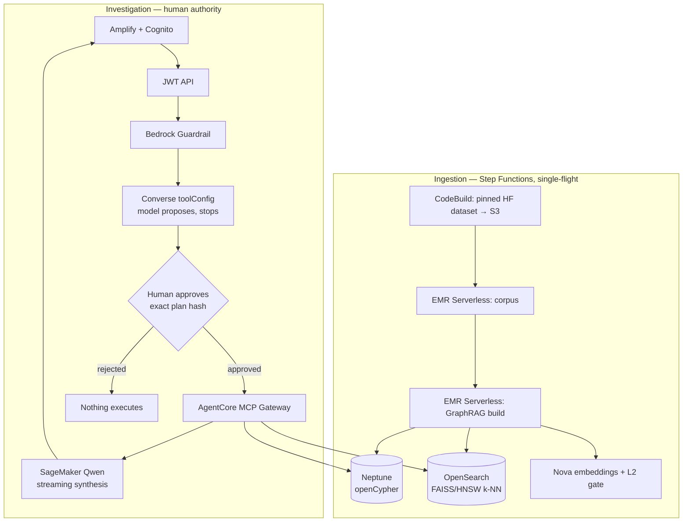

# Sentinel — Governed Agentic GraphRAG on AWS

An operator asks a question about HDFS logs. A model chooses which read-only
evidence tools to call and **stops**. A human approves that exact call plan by
hash. Only then does anything execute. The answer comes back with citations into
OpenSearch and Neptune.

The point of the system is the gap between "the model decided" and "something
happened". Nothing crosses that gap without a person.

> Independent reference architecture. Not an HPE product or endorsement.

## What actually runs

Two paths share one account, one identity plane, and one approval contract.

**1. Investigation (read-only, real data).** Cognito login → Bedrock Guardrail →
the model proposes tools via the Bedrock **Converse API** → human approves the
plan hash → AgentCore MCP Gateway executes the read tools against OpenSearch and
Neptune → a SageMaker-hosted Qwen model writes the findings up.

**2. Remediation (write path, fixture scenarios).** A Step Functions state
machine: `Intake → Retrieve → Plan → Policy → WaitForApproval → Execute →
Verify → Complete | Compensate`, plus `Deny` and `FailClosed`. The approval task
token is held server-side in DynamoDB. A tampered plan hash is rejected with
HTTP 409.

The model can only ever reach the read tools. Approving evidence retrieval never
grants write authority.

### Data fidelity — read this before demoing

| Path | Data |
|---|---|
| Investigation | **Real.** 460k HDFS blocks from a pinned public dataset, real Nova embeddings, a real Neptune graph |
| Remediation | **Fixture scenarios.** Its own output says `"simulated": true` and names a "simulated independent health adapter" |

The governance machinery — hash binding, deterministic policy, approval,
receipt, verification, compensation — is real in both. The *effector* in the
remediation path is simulated. Say so rather than let it be discovered.

## Why Converse and not Bedrock Agents

The original design used a Bedrock Agent whose action group returned
`RETURN_CONTROL`. **That is no longer buildable.** AWS put Bedrock Agents into
maintenance mode; `CreateAgent` fails account-wide for accounts without prior
usage:

```
AccessDeniedException: Bedrock Agents is in Maintenance Mode.
New agent creation is not available for accounts without prior service usage.
```

Verified in `us-east-1`, `us-west-2`, and `eu-west-1`. `RETURN_CONTROL` existed
to make a model propose without executing — Converse does that natively with
`toolConfig`, so the approval kernel (`domain/tool_approval.py`) carries over
**byte-identical**. The legacy path still exists behind
`enable_bedrock_agents = false` and stays off.

AgentCore is a separate service and works fine; the MCP Gateway is what executes
approved tools.

## Architecture



## How the pieces are used

| Service | Used for | Notable choice |
|---|---|---|
| **Bedrock Converse** | Tool selection | `toolChoice: any` on turn 1 — a tool plan is the only legitimate outcome |
| **Bedrock Guardrail** | Input/output filtering | Applied before the model sees the question |
| **AgentCore MCP Gateway** | Executing approved tools | SigV4; read tools on a separate target from write tools |
| **OpenSearch** | Lexical + vector retrieval | `knn_vector`, FAISS, HNSW, inner product on unit vectors |
| **Neptune** | Graph evidence | openCypher, run-scoped, **one query per pattern** so no pattern starves the others |
| **Nova embeddings** | Semantic retrieval | 1024-dim, L2-normalised, pre/post norm validated |
| **EMR Serverless** | Corpus + GraphRAG build | Spark sizing is validated against the capacity ceiling at plan time |
| **SageMaker** | Final synthesis | Qwen3-8B, pinned by immutable ECR digest |
| **Step Functions** | Ingestion + remediation | `.waitForTaskToken` for approval; single-flight lease on ingestion |
| **Cognito** | Identity | `investigator` reads; `approver`/`admin` decide |

## Python layout

Hexagonal. The dependency arrows point one way, and a test enforces that the
domain layer imports no AWS SDK.

```
lambda/app/
  handlers/   7 Lambda entry points        — api, chat, worker, pipeline_gate,
                                             graphrag_tool, mcp_tool, agent_bridge
  domain/     pure logic, zero boto3       — tool_approval, conversation,
                                             converse_tools, policy, planning,
                                             retrieval, core, model, tools
  adapters/   everything that does I/O     — graphrag (OpenSearch/Neptune),
                                             mcp_client (AgentCore)
```

`domain/tool_approval.py` is the approval kernel. It canonicalises arguments,
binds them to a SHA-256 plan hash, and enforces expiry and round. Treat it as
audited code: adapt *around* it rather than editing it.

## Deploy

Use a dedicated disposable AWS account. Requires Terraform 1.10+, AWS CLI v2,
Python 3.11+, Node/npm, `make`, `curl`, `jq`, `zip`.

```bash
export AWS_PROFILE=your-sandbox
export AWS_REGION=us-east-1 AWS_DEFAULT_REGION=us-east-1
export EXPECTED_AWS_ACCOUNT_ID=123456789012 EXPECTED_AWS_REGION=us-east-1
export INITIAL_OPERATOR_EMAIL=you@example.com INITIAL_OPERATOR_GROUPS=admin

make test && make preflight && make deploy
```

Two profiles live in `infra/environments/`:

| Profile | Corpus | Use |
|---|---|---|
| `dev.tfvars` | 1 GiB | **What is verified end to end.** ~$2–3/hr |
| `demo.tfvars` | 100 GiB | Benchmark profile. Needs quota review and `CONFIRM_HPC_COST` |

`make deploy` uses `TFVARS` (default `dev`). For infrastructure without ingesting
a corpus, `make deploy-infra`. For the UI alone, `make deploy-ui`.

## Users

```bash
make add-user EMAIL=oncall@example.com GROUPS=approver
make add-user EMAIL=lead@example.com   GROUPS=approver,admin
make add-users FILE=/secure/path/users.csv
```

Re-running with different groups reconciles membership, which supports
downgrades. If the Cognito invitation email never arrives, the pool uses
`COGNITO_DEFAULT` sending — rate-limited and spam-prone. Set a password directly
with `aws cognito-idp admin-set-user-password ... --no-permanent`, or move the
pool to SES.

## Modifying things

**Change the corpus size.** `target_corpus_gib` and `minimum_corpus_gib` in your
tfvars. Spark sizing must fit the capacity ceiling — `hpc_spark_execution`'s
driver plus `min_executors` is checked against `hpc_maximum_cpu` by a plan-time
precondition, because dynamic allocation will not start a job it cannot place.

**Change the model.** `foundation_model_id` for tool selection;
`sagemaker_model_id` + `sagemaker_model_revision` for synthesis. The synthesis
prompt is projected down in `handlers/chat_handler.py` (`_synthesis_evidence`) —
raw source rows are dropped, because sending them exhausted the GPU's KV cache.

**Add a tool.** Add the schema to `domain/converse_tools.py`, the reason to
`domain/tool_approval.py`'s registry, the implementation to
`adapters/graphrag.py`, and an MCP Gateway target in `infra/modules/agentic`.
Contract tests pin the schemas to `contracts/graphrag-tools/`. For tools bound to
the operator's question, add the name to `OPERATOR_QUERY_TOOLS` so the query is
injected server-side rather than asked of the model.

**Change the finding narrative.** `_probable_cause` and `_action_plan` in
`adapters/graphrag.py` derive from `sequence_profile()` — dominant template,
longest unbroken run, repeating cycle. They deliberately do **not** name what a
Drain template means, because the dataset ships no legend and a confident wrong
cause is worse than an honest structural one.

**Change scenarios.** `lambda/app/domain/fixtures.json`.

**Change policy.** `domain/policy.py` returns `ALLOW`/`DENY`/`REQUIRE_APPROVAL`
with obligations, stamped with a policy version.

Run `make test` after any change. 63 tests, including the local end-to-end suite
that boots a server and drives a real approval.

## Verify it works

```bash
make outputs                    # URLs and resource names
make smoke                      # AWS-side smoke checks
make test                       # 63 tests
```

In the UI, ask the default question, approve the plan, and confirm three
findings with citations. To prove the gate, approve with a modified hash — the
API returns **409 Plan hash mismatch**.

## Teardown

```bash
export CONFIRM_DESTROY=hpe-agentic-remediation-demo
export EXPECTED_AWS_ACCOUNT_ID=123456789012 EXPECTED_AWS_REGION=us-east-1
make destroy-all
```

The single largest cost is the SageMaker GPU endpoint. Deleting only that keeps
findings, evidence, graph, and the approval flow working — you lose the final
prose synthesis.

## Documentation

- [Quick start](QUICKSTART.md) — commands only
- [Tutorials](TUTORIALS.md)
- [Architecture and trust boundaries](docs/ARCHITECTURE.md)
- [Demo script](docs/DEMO_SCRIPT.md)
- [Tool schemas](contracts/graphrag-tools)
