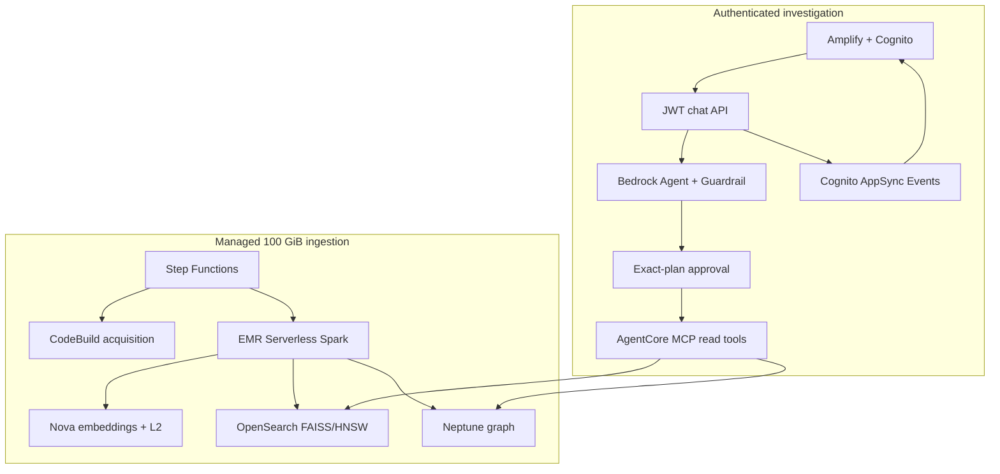

# Autonomous Agents on AWS using GraphRAG (Amazon Neptune)

This unified repository preserves the original governed agentic-remediation demo and replaces only its old hash/count data job with a managed HDFS GraphRAG pipeline. One deployment provisions the AWS services, invites the first operator, acquires the pinned public dataset into S3, creates and processes a physical 100 GiB corpus, publishes coordinated OpenSearch and Neptune stores, and deploys the authenticated Amplify chat UI.

The implementation is an independent reference architecture, not an HPE product or endorsement. It has passed local code, contract, shell, and UI-build checks in this repository. 

## What the demonstration does

An authenticated operator asks a question about the HDFS corpus. A dedicated Bedrock Agent selects bounded GraphRAG tools, but its action group uses `RETURN_CONTROL`: no selected AgentCore MCP call runs until an `approver` or `admin` accepts the exact names, arguments, expiry, round, and SHA-256 plan hash in that same chat. Every later tool batch requires another approval.

After approval, the system returns exactly three ranked anomaly findings with OpenSearch and Neptune evidence, affected blocks/hosts/processes, citations, limitations, and a three-step action plan for a human. The left 25% of the desktop UI shows the public tool/authority trace; the right 75% contains chat, approvals, streaming synthesis, findings, and actions. Private chain-of-thought is never displayed.

The original remediation workflow remains intact and separate:

`INTAKE → RETRIEVE → PLAN → POLICY → APPROVAL → EXECUTE → VERIFY → COMPLETE/COMPENSATE`

GraphRAG tools are read-only. Approving evidence retrieval never grants write authority to remediation tools.

## End-to-end architecture



## Managed Terraform components

| Component | Responsibility |
|---|---|
| `identity` | Invitation-only Cognito user pool and `investigator`, `approver`, `admin` groups |
| `data` | KMS, private versioned S3, DynamoDB state/TTL/PITR |
| `network` | Private subnets, endpoints, and least-path security groups |
| `analytics` + `ingestion` | CodeBuild acquisition, EMR Serverless, single-flight Step Functions pipeline, fail-closed gates |
| `opensearch` | Private OpenSearch 3.1 domain and FAISS/HNSW vector indexes |
| `neptune` | IAM-authenticated graph cluster and S3 bulk-loader role |
| `agentic` | Existing remediation Agent/Guardrail plus dedicated GraphRAG `RETURN_CONTROL` Agent and separate MCP Lambdas |
| `model_serving` | Pinned public Apache-2.0 Qwen image build and SageMaker streaming endpoint |
| `chat`, `api`, `realtime` | Owner-bound JWT API, guarded worker, Cognito-authorized AppSync Events |
| `amplify_ui` | React hosting with CloudFront-scope WAF |
| `workflow`, `worker` | Preserved policy/approval/execution/verification/compensation path |

Terraform also creates a visible AWS Budget. It is an alerting/visibility control, not a hard spend cutoff.

## Data and GraphRAG mechanics

The managed acquisition project downloads `honicky/hdfs-logs-encoded-blocks` at immutable commit `977c62c6c9c7ec1122e75cb92368ea7614e5b688`, validates the dataset card license and expected Parquet count, hashes each object, uploads the files, and writes the S3 readiness manifest last.

Spark then generates an uncompressed 100 GiB+ qualification corpus and, in the timed build:

1. physically scans at least 107,374,182,400 payload bytes;
2. derives deterministic record and event-pattern IDs without using evaluation labels;
3. extracts privacy-preserving host/DataNode identifiers from log parameters;
4. embeds unique patterns with Nova and validates pre/post L2 norms;
5. writes all occurrence metadata plus pattern vectors to run-scoped OpenSearch indexes using `knn_vector`, FAISS, HNSW, and inner product over unit vectors;
6. bulk-loads run-scoped PipelineRun, HDFSBlock, LogTemplate, LogEvent, SourceRecord, ReplicationGroup, Host, DataNode, Process, Anomaly, Evidence, AnomalyType, and RecommendedAction entities and their relationships into Neptune;
7. reconciles client/server OpenSearch counts and expected/loaded Neptune records;
8. validates graph completeness and provenance, then atomically moves OpenSearch aliases and writes a `PUBLISHED` manifest; and
9. runs the real `rank_anomalies(top_k=3)` read-tool smoke check.

Acquisition, corpus generation, infrastructure provisioning, and model startup are reported outside the staged-data GraphRAG processing SLO. The accepted manifest must show `slo_passed_inside_spark=true`; the command reports it as `slo_passed`.

## One-command deployment

Use a dedicated disposable AWS account. Required local tools are Terraform 1.10+, AWS CLI v2, Python 3.11+, Node/npm, `make`, `curl`, `jq`, and `zip`. Confirm service availability, quotas, and the benchmark cost profile in `infra/environments/demo.tfvars`.

```bash
export AWS_PROFILE=YOUR_SANDBOX_PROFILE
export AWS_REGION=us-east-1
export AWS_DEFAULT_REGION=us-east-1
export EXPECTED_AWS_ACCOUNT_ID=123456789012
export EXPECTED_AWS_REGION=us-east-1
export INITIAL_OPERATOR_EMAIL=primary.admin@example.com
export INITIAL_OPERATOR_GROUPS=admin
export CONFIRM_HPC_COST=100G-GRAPHRAG

make test
make preflight
make deploy
```

`make deploy` is the complete path: two-phase Terraform deployment, immutable model image resolution, first-user invitation, managed dataset acquisition, physical corpus generation, GraphRAG publication/smoke gate, and Amplify UI publication. Set `AUTO_APPROVE=1` only when unattended Terraform apply is intentional in the verified sandbox.

The first operator receives a Cognito temporary-password email and sets a permanent password on initial sign-in. The UI URL is:

```bash
terraform -chdir=infra output -raw graphrag_ui_url
```

For infrastructure/model/UI without loading the 100 GiB corpus, use `make deploy-infra`.

## Add or change users

No temporary password is stored in Terraform state. User provisioning is a deployment command that reads the Terraform-created pool, verifies the exact AWS account/Region, sends Cognito invitations for new users, and idempotently reconciles managed group membership.

```bash
make add-user EMAIL=oncall.approver@example.com GROUPS=approver
make add-user EMAIL=platform.owner@example.com GROUPS=admin
make add-user EMAIL=lead@example.com GROUPS=approver,admin
```

For multiple users, copy `config/users.example.csv` to a protected local file and run:

```bash
make add-users FILE=/secure/path/users.csv
```

To include the file in the initial deployment, set `DEPLOY_USERS_FILE=/secure/path/users.csv`. An `investigator` can create and read their own chats but cannot approve tool calls. Only `approver` and `admin` can make the in-chat decision. Running the command again with a different role removes obsolete managed-role membership, which supports explicit downgrades.

## Re-run and qualify the benchmark

```bash
export CONFIRM_HPC_COST=100G-GRAPHRAG
make benchmark-100g
```

The command starts the managed Standard Step Functions ingestion state machine and prints a machine-readable accepted result. Retain the execution ARN and S3 manifest. Run it three times under the intended account, Region, capacity, and quota conditions before claiming reproducible `100 GiB in <=10 minutes` performance.

## Destroy all deployed resources

```bash
export CONFIRM_DESTROY=hpe-agentic-remediation-demo
export EXPECTED_AWS_ACCOUNT_ID=123456789012
export EXPECTED_AWS_REGION=us-east-1
make destroy-all
```

`make destroy-all` applies a saved Terraform destroy plan, verifies the application state is empty, destroys the optional remote-state bootstrap last, removes only generated local configuration, and fails if tagged non-KMS resources remain in the deployment Region or global-service Region. AWS-mandated KMS pending-deletion records can remain temporarily, but those keys cannot be used.

## Documentation

- [Command-only quick start](QUICKSTART.md)
- [Deployment, users, chat approval, benchmark, and teardown tutorials](TUTORIALS.md)
- [Business and engineering implementation report](IMPLEMENTATION_REPORT.md)
- [Reconciliation and validation report](RECONCILIATION_REPORT.md)
- [Architecture and trust boundaries](docs/ARCHITECTURE.md)
- [GraphRAG demo script](docs/DEMO_SCRIPT.md)
- [Engineering plan](ENGINEERING_PLAN_GRAPHRAG_100G.md)
- [Versioned GraphRAG tool schemas](contracts/graphrag-tools)
