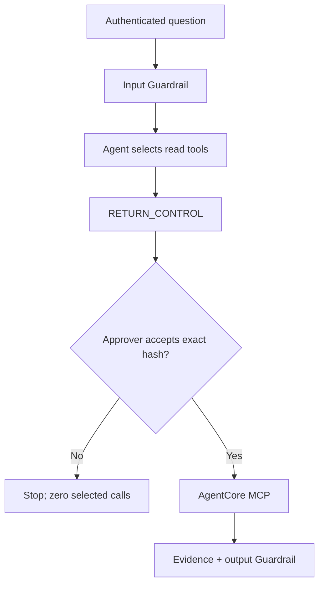

# AWS HDFS GraphRAG Execution Tutorials

This runbook covers account preparation, complete deployment, operator administration, managed 100 GiB ingestion, chat-based human approval, evidence inspection, repeatable qualification, and complete teardown. It also explains how the new investigation path coexists with the original governed remediation workflow.

## 1. Know the two authority boundaries

The solution keeps evidence access and operational execution independent.

1. **GraphRAG read approval.** The dedicated Bedrock Agent autonomously selects closed-schema read tools. `RETURN_CONTROL` sends those calls back to the chat without executing them. An `approver` or `admin` must accept the exact canonical hash. Every additional selection round pauses again.
2. **Remediation write approval.** The preserved Step Functions workflow applies deterministic policy to proposed operational changes. An exact write-plan approval, executor revalidation, receipt, independent verification, and compensation remain mandatory where policy requires them.

Approving GraphRAG retrieval does not approve remediation.



## 2. Prepare a disposable AWS account

The benchmark profile is intentionally large. Verify budget authority, OpenSearch capacity and GPU acceleration availability, EMR Serverless vCPU quota, Neptune availability, Bedrock/Nova access, SageMaker capacity, and AgentCore support in the target Region.

Install Terraform 1.10+, current AWS CLI v2, Python 3.11+, Node/npm, `make`, `curl`, `jq`, and `zip`. Prefer IAM Identity Center to long-lived keys.

```bash
aws configure sso --profile hdfs-graphrag-demo
aws sso login --profile hdfs-graphrag-demo
export AWS_PROFILE=hdfs-graphrag-demo
export AWS_REGION=us-east-1
export AWS_DEFAULT_REGION=us-east-1
export EXPECTED_AWS_ACCOUNT_ID=123456789012
export EXPECTED_AWS_REGION=us-east-1

aws sts get-caller-identity
```

Review `infra/environments/demo.tfvars`, especially instance counts, storage, EMR limits, Neptune capacity, owner/cost tags, and `force_destroy` behavior.

## 3. Run local and account preflight checks

```bash
make test
make preflight
```

When Terraform is installed locally, also run:

```bash
terraform -chdir=infra init -backend=false
terraform -chdir=infra fmt -check -recursive
terraform -chdir=infra validate
terraform -chdir=infra plan -var-file=environments/demo.tfvars
```

Preflight verifies the expected account, current principal, Bedrock chat and embedding models, Guardrails, Agents, AgentCore, EMR Serverless, OpenSearch, Neptune, SageMaker, AppSync, Amplify, Cognito, CodeBuild, Step Functions, WAF, and Budgets APIs. It is a capability check, not a quota reservation.

## 4. Deploy the complete system

Choose the first operator. The default role is `admin`.

```bash
export INITIAL_OPERATOR_EMAIL=primary.admin@example.com
export INITIAL_OPERATOR_GROUPS=admin
export CONFIRM_HPC_COST=100G-GRAPHRAG
make deploy
```

For explicit non-interactive Terraform application in the verified sandbox:

```bash
AUTO_APPROVE=1 make deploy
```

The wrapper executes these phases in order:

1. validates the public, non-gated Apache-2.0 model and immutable revision;
2. plans/applies the Terraform foundation without a SageMaker endpoint;
3. builds the account-owned inference image in CodeBuild;
4. resolves the image to an immutable ECR digest;
5. plans/applies the complete data, identity, agentic, model, API, security, and UI infrastructure;
6. creates or reconciles the initial Cognito user and sends a temporary-password invitation for a new account;
7. starts the managed ingestion state machine and waits for all gates;
8. builds and publishes the Amplify UI only after GraphRAG is query-ready.

The full deployment intentionally stops if the initial email or cost acknowledgement is absent. `make deploy-infra` remains available for infrastructure/model/UI work that should not process the 100 GiB corpus.

## 5. Provision users and groups

Terraform owns the Cognito pool, client, and groups. The deployment script owns user invitations and membership so temporary credentials never enter Terraform state.

### One user

```bash
make add-user EMAIL=oncall.approver@example.com GROUPS=approver
make add-user EMAIL=platform.admin@example.com GROUPS=admin
make add-user EMAIL=lead@example.com GROUPS=approver,admin
```

The command:

- requires `EXPECTED_AWS_ACCOUNT_ID` and `EXPECTED_AWS_REGION`;
- resolves the pool from the active Terraform state;
- creates a missing user with verified email delivery through Cognito;
- keeps an existing user instead of duplicating it;
- adds requested managed groups and removes obsolete managed groups; and
- prints the final membership returned by Cognito.

Role behavior:

| Group | Chat access | MCP decision | Intended use |
|---|---:|---:|---|
| `investigator` | Own sessions only | No | Ask questions and view results already authorized for that session |
| `approver` | Own sessions only | Yes | On-call/operator approval of exact read plans |
| `admin` | Own sessions only | Yes | Demo administration and approval |

All chat records are bound to the JWT subject. Cross-user reads are returned as not found. AppSync subscription handlers similarly allow only `/sessions/{subject}/chat-…`.

### Bulk users

Copy the example outside the repository and protect the working copy:

```bash
cp config/users.example.csv /secure/path/users.csv
chmod 600 /secure/path/users.csv
make add-users FILE=/secure/path/users.csv
```

Format:

```text
email,groups
primary.admin@example.com,admin
oncall.approver@example.com,approver
lead@example.com,approver,admin
```

To apply the file as part of the full deployment:

```bash
export DEPLOY_USERS_FILE=/secure/path/users.csv
make deploy
```

Re-run the same command at any time. Membership reconciliation is idempotent. To downgrade a user, run the command with only the lower role. User deletion is intentionally not automated by the add/assign command; delete or disable a user explicitly with your approved identity-administration process.

## 6. Understand the managed ingestion state machine

`make deploy` invokes `make benchmark-100g` automatically. A later rerun uses:

```bash
export CONFIRM_HPC_COST=100G-GRAPHRAG
make benchmark-100g
```

The Standard Step Functions workflow is single-flight:

1. acquires a DynamoDB lease;
2. runs the managed CodeBuild acquisition project;
3. validates the immutable READY manifest;
4. runs the EMR corpus generator;
5. verifies physical S3 bytes are at least 100 GiB;
6. runs the timed EMR GraphRAG job;
7. verifies the `PUBLISHED` manifest, run/revision, L2 and label isolation flags, exact Neptune reconciliation, and Spark SLO;
8. calls the real GraphRAG tool Lambda and requires exactly three findings; and
9. releases the lease on success or failure.

The formal 600-second value is `elapsed_seconds_inside_spark`. Public acquisition, corpus generation, infrastructure deployment, and model startup are separate. The command also reports end-to-end state-machine wall time.

The timed Spark job physically scans the synthetic payload, builds deterministic record/pattern entities, calls Nova for unique pattern embeddings, validates L2 unit norms, bulk-writes OpenSearch, bulk-loads Neptune, validates counts/relationships/provenance, swaps read aliases, and commits the publication manifest.

Do not claim the ten-minute objective from source inspection or a single successful run. Retain three manifests from the target account under the same capacity and quota conditions.

## 7. Sign in and approve tools in chat

Get the UI:

```bash
terraform -chdir=infra output -raw graphrag_ui_url
```

Open it, enter the invited email and temporary password, then complete Cognito's new-password challenge. Ask:

> Identify the three most important anomalous HDFS log behaviors and give me an action plan.

Expected sequence:

1. API Gateway verifies the Cognito ID token and the API stores the subject as chat owner.
2. The worker applies the Bedrock Guardrail to input.
3. Bedrock Agent selects one to four GraphRAG functions; round one must include `rank_anomalies` with `top_k=3`.
4. `RETURN_CONTROL` pauses the worker before the selected MCP calls.
5. The UI displays tool names, exact bounded arguments, public purpose, read-only authority, expiry, round, and plan hash.
6. An `approver` or `admin` selects **Approve exact plan** or **Reject plan**.
7. The API verifies owner, role, current status, expiry, query, round, and hash. A rejection executes none of those selected calls.
8. On approval, the worker revalidates the plan and invokes only its exact calls through the AgentCore Gateway.
9. A later selected batch creates a new approval card and hash.
10. The worker requires approved top-three evidence, streams bounded synthesis through AppSync Events, applies output Guardrails, and persists polling recovery state.

The 25% left column explains public stages and tool use. It must not be described as private chain-of-thought. The 75% workspace shows chat, approvals, exactly three ranked cards, graph paths/citations, and actions for the human.

### Demonstrate denial

Create a new chat and choose **Reject plan**. The session enters `REJECTED`; the selected MCP calls do not execute and no evidence-based answer is synthesized.

### Direct API testing

The UI is the supported interaction. For an authorized integration test, obtain a short-lived Cognito ID token through your approved client flow and avoid printing it:

```bash
export API_URL="$(terraform -chdir=infra output -raw demo_url)"
export CHAT_ID="chat-$(python3 -c 'import uuid; print(uuid.uuid4())')"
export ID_TOKEN='SHORT_LIVED_COGNITO_ID_TOKEN'

curl --fail --silent --show-error -X POST "$API_URL/api/chats" \
  -H "authorization: Bearer $ID_TOKEN" \
  -H "content-type: application/json" \
  --data "$(jq -nc --arg chat_id "$CHAT_ID" --arg query 'Identify the top three HDFS anomalies' \
    '{chat_id:$chat_id,query:$query}')" | jq
```

Never use the legacy `x-demo-token` for `/api/chats`; chat routes require Cognito JWTs. The legacy token remains only for preserved `/api/workflows` routes.

## 8. Inspect evidence and operating state

```bash
terraform -chdir=infra output -raw graphrag_ingestion_state_machine_arn
terraform -chdir=infra output -raw evidence_bucket
terraform -chdir=infra output -raw opensearch_endpoint
terraform -chdir=infra output -raw neptune_writer_endpoint
terraform -chdir=infra output -raw graphrag_bedrock_agent_id
terraform -chdir=infra output -raw graphrag_tool_function_name
```

List recent ingestion executions:

```bash
aws stepfunctions list-executions \
  --state-machine-arn "$(terraform -chdir=infra output -raw graphrag_ingestion_state_machine_arn)" \
  --max-results 10 | jq
```

List published manifests:

```bash
BUCKET="$(terraform -chdir=infra output -raw evidence_bucket)"
aws s3 ls "s3://$BUCKET/hpc/graphrag/runs/" --recursive | grep '/manifests/published/'
```

An awaiting chat record contains a pending plan but no selected MCP results. A completed record contains approval history and public findings. Never export table contents to an unapproved location.

## 9. Demonstrate preserved remediation

Get the legacy URL:

```bash
terraform -chdir=infra output -raw open_demo_command
```

Use an approval-required scenario to show deterministic policy, the exact write-plan hash, executor revalidation, idempotent receipt, independent verification, and compensation. This workflow remains separate from the read-only GraphRAG approval.

## 10. Troubleshoot without bypassing controls

- **Invitation not received:** check Cognito user status and the account's email-delivery constraints; do not put a temporary password in Terraform.
- **403 on approval:** confirm the signed-in user is in `approver` or `admin`, sign out, and sign in again so the new short-lived token contains updated group claims.
- **409 on approval:** re-read the current chat. The plan changed, expired, or was already decided; never reuse another hash.
- **No Agent selection:** verify the GraphRAG Agent alias has enabled `GraphRAGReadTools` with `RETURN_CONTROL`.
- **MCP failure after approval:** inspect the separate GraphRAG tool Lambda, AgentCore target, OpenSearch aliases, Neptune IAM path, Nova access, and publication smoke gate. There is no fixture fallback.
- **Benchmark misses 600 seconds:** use manifest stage durations and service metrics. Do not reduce scanned bytes, relax reconciliation, or omit graph publication to manufacture a pass.
- **Stale Cognito group:** re-run `make add-user`, then refresh authentication. Group changes are reflected in newly issued tokens.

## 11. Destroy every Terraform-managed resource

Use the same account and Region guards used during deploy:

```bash
export CONFIRM_DESTROY=hpe-agentic-remediation-demo
export EXPECTED_AWS_ACCOUNT_ID=123456789012
export EXPECTED_AWS_REGION=us-east-1
make destroy-all
```

For a confirmed disposable account:

```bash
AUTO_APPROVE=1 make destroy-all
```

The script verifies account/tfvars Region, applies a saved destroy plan, confirms the main Terraform state is empty, destroys optional remote state last, and queries tagged resources in both the workload and global-service Region. It fails if non-KMS resources remain. AWS retains KMS key records in pending deletion for its mandatory waiting period.

## 12. Acceptance checklist

- Cognito invitation and permanent-password sign-in succeed.
- An `approver` and `admin` can decide; an `investigator` receives HTTP 403.
- Chat ownership and AppSync subscription paths are subject-bound.
- Input and output Guardrails intervene as designed.
- GraphRAG action group uses `RETURN_CONTROL`.
- No selected MCP request occurs before the matching approval.
- Rejection, expiry, tampering, cross-chat hashes, and query rewriting fail closed.
- Round one contains `rank_anomalies(top_k=3)` and every later round has a new approval.
- Final UI contains exactly three evidence-backed findings and human actions.
- Evaluation labels do not enter retrieval, embeddings, graph, or ranking.
- OpenSearch vectors use FAISS/HNSW and validated L2 normalization.
- Neptune counts, required anomaly relationships, and provenance validate before publication.
- The original remediation approval/execution/verification/compensation tests still pass.
- Three target-account manifests show physical 100 GiB+ input and `slo_passed=true` before making the performance claim.
- `make destroy-all` leaves empty Terraform application state and no tagged non-KMS resources.
