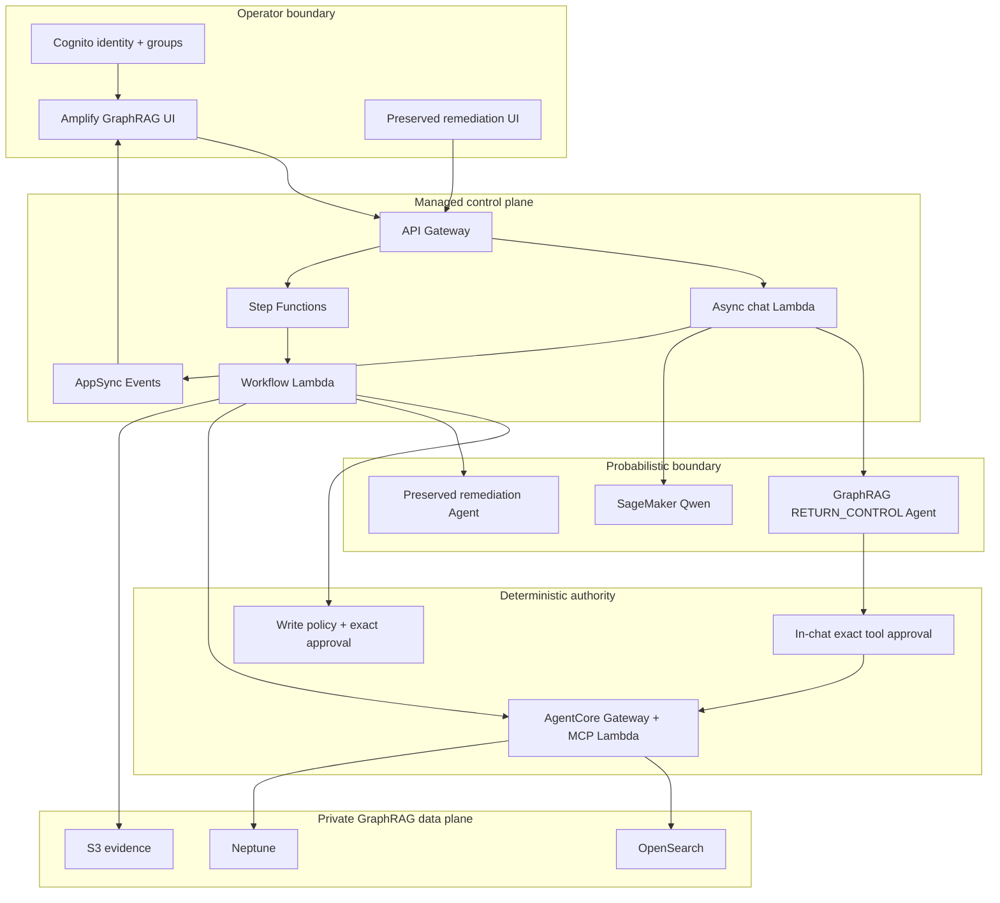
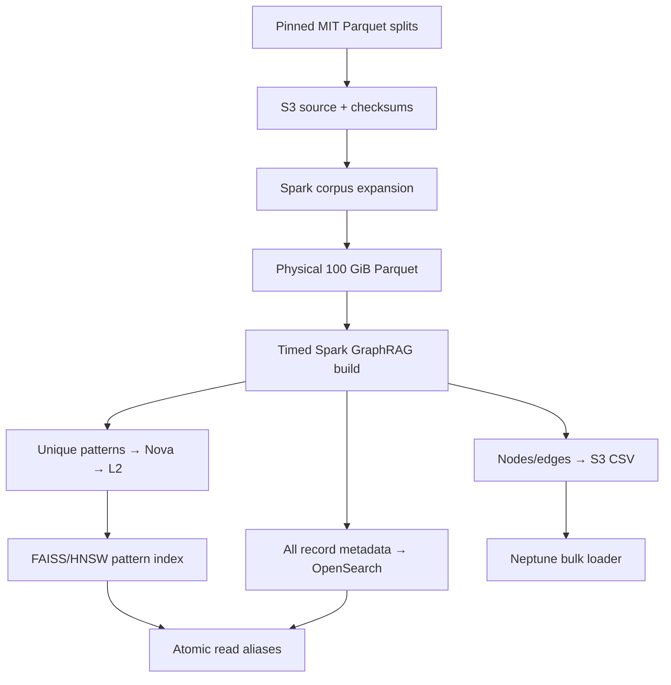
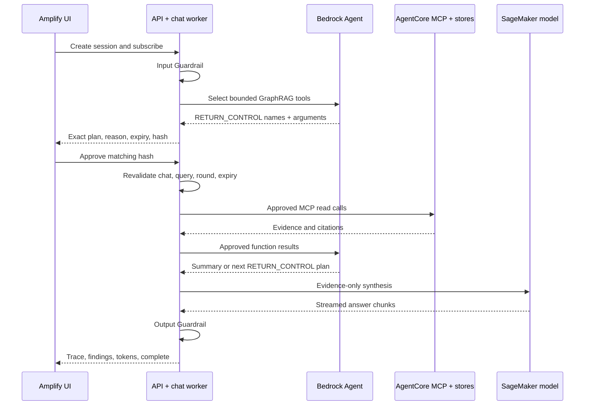

# Architecture and Trust Boundaries

## System topology

The dedicated GraphRAG Agent can select only read functions and its action group returns control without executing them. The chat user must approve the exact hash-bound selection before the worker calls MCP. The preserved remediation Agent remains separate. Existing write-oriented MCP tools remain callable only from the workflow role after deterministic policy and, when required, task-token approval bound to the canonical write-plan hash.

## Data build

The large synthetic field is not placed in online stores. It exists to prove a physical 100 GiB scan. Every expanded occurrence is represented by deterministic record metadata in OpenSearch and resolves to a source block and semantic pattern. This avoids embedding identical replicated content millions of times while preserving coverage and lineage.

## Online anomaly method

The build computes two label-independent features per canonical pattern:

- rarity: inverse log frequency within the staged corpus;
- structural deviation: bounded z-score of sequence length.

The stored anomaly score is `0.65 × rarity + 0.35 × structural deviation`. At query time, reciprocal-rank fusion combines lexical OpenSearch results and L2-normalized Nova/FAISS similarity. The anomaly score supplies a small deterministic ranking contribution. Neptune then expands the candidates to HDFS blocks and event codes. Labels remain in a run-specific evaluation-only S3 prefix.

This transparent baseline is suitable for demonstrating evidence-grounded GraphRAG. It is not a claim that rarity/length alone is an optimal production detector; production promotion should add calibrated temporal, host, and operational features and measure precision/recall against the isolated labels.

## Chat sequence

The first selection round must include `rank_anomalies` with `top_k=3`. Any later selection creates a new approval plan. The agent remains responsible for tool selection and diagnosis, while deterministic code controls authority, enforces exact top-three evidence, and rejects plan mutation, replay, or expiry.

## Public explanation versus private reasoning

The left panel exposes only auditable operational facts: stage, tool name, declared reason, read-only authority, and bounded result count. It does not expose hidden prompts, model scratch work, private chain-of-thought, credentials, MCP sessions, or approval task tokens.

## Security controls retained

- versioned Bedrock Guardrail on agent input/output and explicit chat input/output checks;
- invitation-only Cognito users, short-lived JWTs, owner-bound chats, approver/admin decisions, and subject-bound event subscriptions;
- isolated IAM roles for API, chat, worker, bridge, MCP, EMR, Neptune loader, CodeBuild, and SageMaker;
- VPC-only OpenSearch and Neptune access with security-group references;
- KMS encryption, TLS-only S3, private buckets, DynamoDB encryption/TTL/PITR;
- closed tool argument allowlists and versioned JSON schemas;
- dedicated GraphRAG `RETURN_CONTROL` Agent and in-chat approval before every selected MCP batch;
- canonical evidence/plan hashes and exact-plan approval;
- idempotent execution receipts, independent verification, and compensation;
- run-scoped indexes and atomic aliases after count reconciliation;
- immutable source/model revisions and an immutable ECR runtime digest;
- fail-closed benchmark and account/Region-guarded teardown.

The hosted GraphRAG UI uses Cognito JWTs and contains neither an AppSync API key nor the preserved legacy demo token. The shared disposable token remains only on the original remediation routes for backward compatibility. Use enterprise federation/MFA, scoped origins, lifecycle governance, and tenant-aware authorization before production use.
